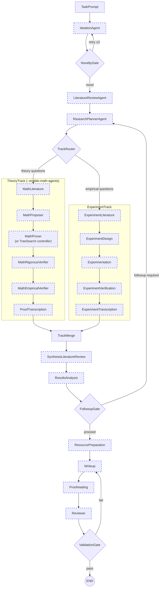
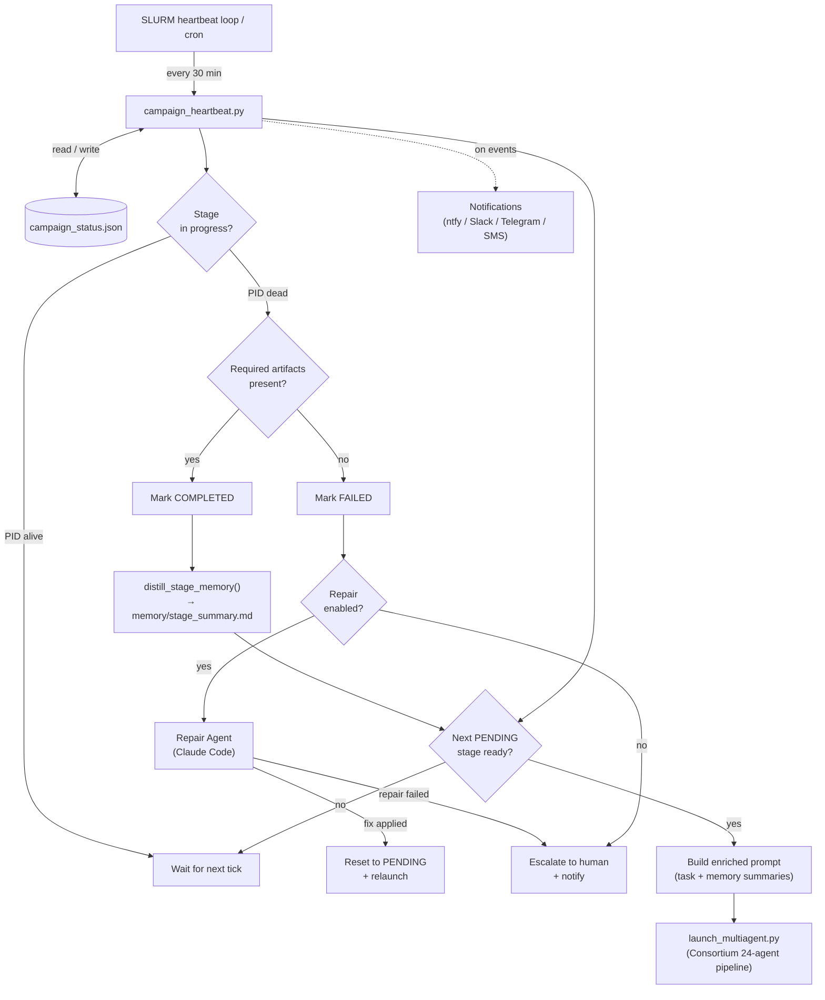
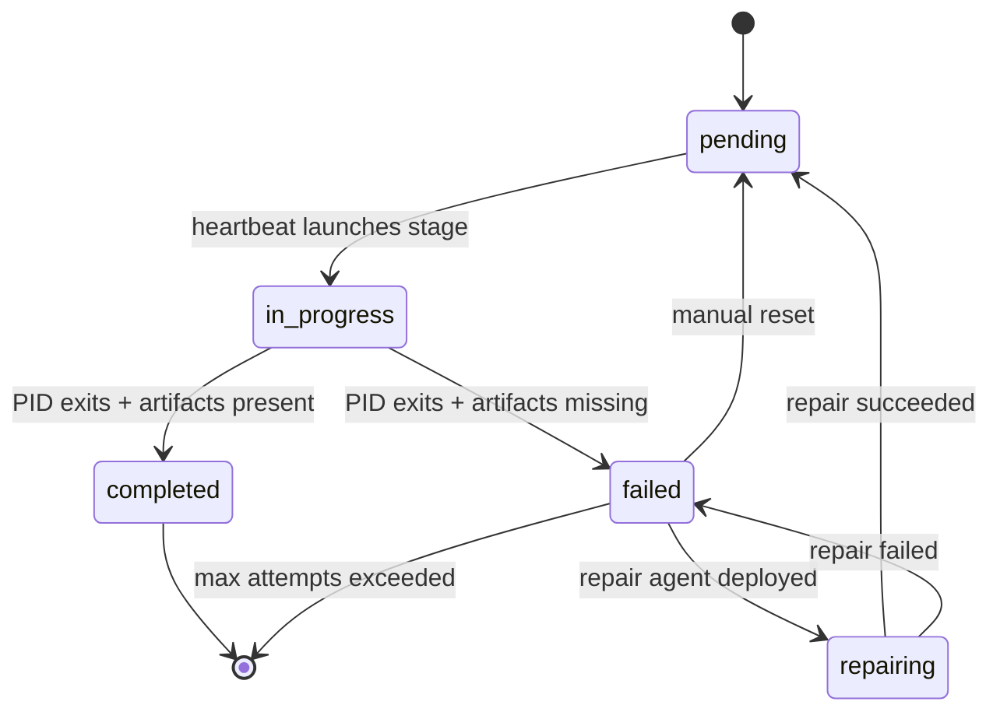
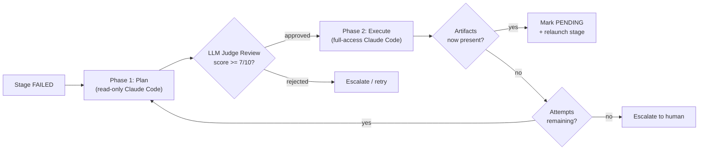
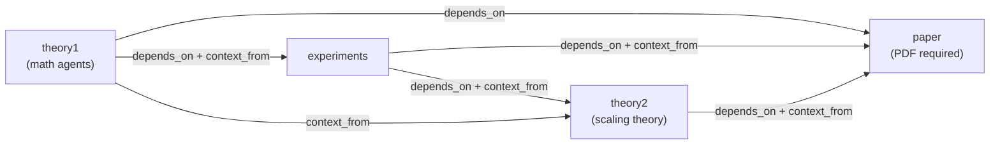

# consortium: Multi-Agent Research-to-Paper Pipeline

Goal: Bring down the steer rate by 2-3 orders of magnitude. Don't know exactly what research will be automated, but we estimate that to go from idea/hypothesis to final paper of low to average quality, one needs on order of magnitude of 10^2 GPT Pro Calls, and we want to bring this down to 0-10 user prompts (steers). 

`consortium` is a local agentic research platform that turns a research prompt into literature-grounded, experiment-backed, and optionally theorem-verified paper artifacts.

- License: MIT (`LICENSE`)
- Runtime: Python 3.11 (recommended via conda)
- Entry point: `launch_multiagent.py`
- Core package: `consortium/`

> Runtime note: the launcher now runs a fixed workflow graph. `--pipeline-mode` is accepted for backward compatibility but ignored.

---

## 5-Minute Quickstart

> **Cost**: ~$2–10 (single model, no counsel) | **Time**: 15–40 min | **Requires**: one API key

```bash
# 1. Bootstrap environment (one-time, ~5 min)
./scripts/bootstrap.sh researchlab minimal

conda activate researchlab

# 2. Set your API key (only one provider needed)
cp .env.example .env
echo "ANTHROPIC_API_KEY=your_key_here" >> .env   # or OPENAI_API_KEY / GOOGLE_API_KEY

# 3. Validate setup without spending tokens
python launch_multiagent.py --task "test" --dry-run

# 4. Run the included quickstart example (~$3, produces markdown paper draft)
python launch_multiagent.py \
  --task "$(cat examples/quickstart/task.txt)" \
  --output-format markdown \
  --no-counsel \
  --no-log-to-files
```

After the run, look in `results/consortium_<timestamp>/` for:
- `final_paper.md` — the generated paper draft
- `paper_workspace/literature_review.pdf` — literature synthesis
- `budget_state.json` — total tokens and cost used

**Want a full paper with LaTeX/PDF?** Install LaTeX (`./scripts/bootstrap.sh researchlab latex`) and drop `--output-format markdown`.

**Want multi-model quality?** Add `--enable-counsel` (requires OpenAI + Anthropic + Google keys; ~4× cost).

**Want math theorem verification?** Add `--enable-math-agents` (see [Math Workflow](#math-workflow)).

---

## Table of Contents

- [What This Platform Does](#what-this-platform-does)
- [Guarantees and Non-Guarantees](#guarantees-and-non-guarantees)
- [Known Limitations](#known-limitations)
- [How the Pipeline Works](#how-the-pipeline-works)
- [Quick Start](#quick-start)
- [Installation (Detailed)](#installation-detailed)
- [Configuration](#configuration)
- [Common Run Commands](#common-run-commands)
- [Resume and Stage-Based Resume](#resume-and-stage-based-resume)
- [Stable Task Templates](#stable-task-templates)
- [Live Steering During a Run](#live-steering-during-a-run)
- [OpenClaw Campaign Orchestration](#openclaw-campaign-orchestration)
  - [Stage State Machine](#stage-state-machine)
  - [Autonomous Repair Agent](#autonomous-repair-agent)
  - [Memory Distillation](#memory-distillation)
  - [Campaign Budget Management](#campaign-budget-management)
  - [Notifications](#notifications)
  - [Campaign Stage DAG](#campaign-stage-dag)
  - [SLURM / HPC Deployment](#slurm--hpc-deployment)
- [CLI Reference](#cli-reference)
- [Understanding Outputs](#understanding-outputs)
- [Quality Gates and Artifact Contracts](#quality-gates-and-artifact-contracts)
- [Submission Checklist (NeurIPS / ICML / ICLR)](#submission-checklist-neurips--icml--iclr)
- [Architecture and Module Map](#architecture-and-module-map)
- [Math Workflow](#math-workflow)
- [Runtime and Cost Expectations](#runtime-and-cost-expectations)
- [Counsel Mode (Multi-Model Debate)](#counsel-mode-multi-model-debate)
- [Agentic Tree Search](#agentic-tree-search)
- [Experiment Execution Safety Model](#experiment-execution-safety-model)
- [Empirical Quality Evidence](#empirical-quality-evidence)
- [Troubleshooting](#troubleshooting)
- [Running Tests](#running-tests)
- [License](#license)

## What This Platform Does

Given a `--task`, the active single-run LangGraph workflow:

1. Explores the problem through ideation and literature review
2. Builds a research plan and writes `paper_workspace/track_decomposition.json`
3. Launches the theory track, experiment track, or both in parallel based on that decomposition
4. Merges and synthesizes track outputs, then runs results analysis and a follow-up decision
5. Loops back to planning when more theory or experiments are needed
6. Prepares resources, writes the paper, proofreads it, reviews it, and runs final validation gates
7. Optionally enables theorem/proof work via `--enable-math-agents`
8. Optionally enables multi-model debate at each specialist stage via `--enable-counsel`
9. Optionally enables agentic tree search (`--enable-tree-search`) to explore multiple proof strategies in parallel via DAG-layered best-first search
10. Supports autonomous multi-stage campaigns via OpenClaw or cron (`OpenClaw_Use_Guide.md`)

Runs are resumable through LangGraph checkpoints (`checkpoints.db`) and can be steered live over TCP/HTTP.

## Guarantees and Non-Guarantees

### What Consortium Guarantees

- **Workflow execution**: Given valid API keys and a task prompt, the pipeline will execute every stage in the fixed workflow graph and produce the documented artifacts.
- **Artifact generation**: Each stage produces its mandatory output files (see [Quality Gates and Artifact Contracts](#quality-gates-and-artifact-contracts)).
- **Budget enforcement**: The pipeline will halt before exceeding the configured `budget.usd_limit`.
- **Checkpointing**: Every completed stage is persisted to SQLite. A crashed run can be resumed from the last checkpoint.
- **Validation gates**: When `--enforce-paper-artifacts` or `--enforce-editorial-artifacts` are enabled, the pipeline will not report success unless the specified artifacts exist and pass structural checks.

### What Consortium Does NOT Guarantee

- **Scientific correctness**: All generated claims, proofs, experimental results, and literature citations require human verification before any submission or publication.
- **Reproducibility across runs**: LLM outputs are stochastic. Two runs with the same task and model will produce different papers.
- **Calibrated review scores**: The reviewer agent's `overall_score` is an internal heuristic used to drive the revision loop. It is not a calibrated acceptance probability and should not be interpreted as a prediction of peer-review outcome.
- **Novelty**: The ideation agent searches existing literature but cannot guarantee that a generated idea is truly novel. Manual novelty verification is required.
- **Factual accuracy of citations**: Citation metadata is fetched from arXiv and Semantic Scholar. Papers may be miscited, misattributed, or retracted.
- **Code correctness**: Experiment code is AI-generated. Results may contain bugs, incorrect baselines, or misleading metrics.

## Known Limitations

1. **No ground-truth verification**: The pipeline has no oracle for scientific truth. Quality gates check structural completeness (file exists, score above threshold), not factual accuracy.
2. **Reviewer score is not calibrated**: `--min-review-score 8` means "the LLM reviewer assigned 8/10," not "this paper has an 80% chance of acceptance." The score distribution depends on the model, prompt, and paper domain.
3. **Experiment execution has no OS-level sandboxing**: `RunExperimentTool` launches AI-Scientist-v2 as a subprocess on the host (or via SLURM). There is no Docker container, cgroup, or resource-limit enforcement beyond a configurable timeout. See [Experiment Execution Safety Model](#experiment-execution-safety-model).
4. **Single-run stochasticity**: The pipeline is a fixed workflow graph (stages always execute in the same order), but LLM outputs are non-deterministic. "Fixed workflow graph" refers to the execution topology, not output reproducibility.
5. **Budget tracking is best-effort**: Token-to-cost conversion depends on provider pricing tables embedded in litellm. Actual billed amounts may differ.
6. **LaTeX compilation failures**: The writeup agent generates LaTeX that may not compile on first attempt. The revision loop retries, but complex papers may require manual fixup.

## How the Pipeline Works

### Phase-Based Execution Graph

The single-run pipeline is a direct-wired LangGraph workflow, not a manager hub and not a purely linear stage list. It executes in five phases:

**1. Discovery**
- `ideation_agent`
- `novelty_gate` (loops back to ideation if the idea is not novel, up to 3 attempts)
- `literature_review_agent`
- `research_planner_agent`

The planner produces `paper_workspace/track_decomposition.json`, which contains:
- `theory_questions`
- `empirical_questions`
- `recommended_track`
- `rationale`

**2. Parallel Track Execution**
- **Theory track** (when `--enable-math-agents` is enabled and the planner selects theory work):
  - `math_literature_agent`
  - `math_proposer_agent`
  - `math_prover_agent`
  - `math_rigorous_verifier_agent`
  - `math_empirical_verifier_agent`
  - `proof_transcription_agent`
- **Experiment track** (when the planner selects empirical work):
  - `experiment_literature_agent`
  - `experiment_design_agent`
  - `experimentation_agent`
  - `experiment_verification_agent`
  - `experiment_transcription_agent`

**3. Merge And Interpretation**
- `track_merge`
- `synthesis_literature_review_agent`
- `results_analysis_agent`

**4. Follow-Up Loop**
- `followup_gate` sends control back to `research_planner_agent` when more theory or experiments are needed
- otherwise the run proceeds to paper production

**5. Paper Production And Final QA**
- `resource_preparation_agent`
- `writeup_agent`
- `proofreading_agent`
- `reviewer_agent`
- `validation_gate`



If the planner selects no execution tracks, the graph falls through directly to `track_merge`, then continues through synthesis and results analysis.

**Counsel mode** (`--enable-counsel`): Nodes with dashed purple borders run multi-model debate when counsel is enabled. Each specialist node runs four independent model executions (Opus, Sonnet, GPT-5.4, Gemini 3.0 Pro), then a debate + synthesis round before promoting consensus artifacts. See [Counsel Mode](#counsel-mode-multi-model-debate).

**Tree search** (`--enable-tree-search`): In the theory track, the linear `MathProver` stage is replaced by a tree search controller that explores multiple proof strategies in parallel via DAG-layered best-first search. See [Agentic Tree Search](#agentic-tree-search).

## Quick Start

From repository root (`consortium`):

```bash
./scripts/bootstrap.sh researchlab full
conda activate researchlab
cp .env.example .env
# Edit .env and add at least one API key
python scripts/preflight_check.py --with-docs --with-web --with-experiment --with-latex

# Recommended first run (single-model, lower cost):
python launch_multiagent.py \
  --task "Investigate this topic and produce a paper draft with evidence-backed claims." \
  --no-counsel \
  --no-log-to-files
```

Artifacts are written to `results/consortium_<timestamp>/`.

## Installation (Detailed)

### Prerequisites

- macOS or Linux
- Conda (Miniconda or Anaconda)
- At least one LLM API key

### Standard Bootstrap

```bash
./scripts/bootstrap.sh <env_name> <profile>
```

Supported profiles:

- `minimal`: core runtime
- `docs`: document/audio parsing stack
- `web`: web crawling stack + Playwright Chromium install
- `experiment`: experiment tool dependencies
- `latex`: TeX toolchain (`pdflatex`, `bibtex`)
- `full`: all capabilities

Profiles can be combined:

```bash
./scripts/bootstrap.sh researchlab minimal,web
```

### Alternative: Cross-Platform Conda Spec

```bash
conda env create -f environment.cross-platform.yml
conda activate consortium
```

This installs the core runtime without running bootstrap scripts.

### API Keys (`.env`)

Copy `.env.example` to `.env` and fill the providers you use:

```bash
OPENAI_API_KEY=your_openai_api_key_here
# ANTHROPIC_API_KEY=your_anthropic_api_key_here
# GOOGLE_API_KEY=your_google_api_key_here
# OPENROUTER_API_KEY=your_openrouter_api_key_here
# DEEPSEEK_API_KEY=your_deepseek_api_key_here
# XAI_API_KEY=your_xai_api_key_here
# SERPER_API_KEY=your_serper_api_key_here
# SEARXNG_INSTANCE_URL=https://your-searxng-instance
```

Counsel mode requires:

- `OPENAI_API_KEY`
- `ANTHROPIC_API_KEY`
- `GOOGLE_API_KEY`

### Preflight Validation

```bash
python scripts/preflight_check.py --with-docs --with-web --with-experiment --with-latex
```

Remove flags for capabilities you did not install.

## Configuration

### Model Selection Precedence

Model settings are resolved in this order:

1. Built-in defaults in `consortium/runner.py` (`gpt-5`, `reasoning_effort=high`, `verbosity=medium`)
2. `.llm_config.yaml`
3. CLI overrides (`--model`, `--reasoning-effort`, `--verbosity`)

### `.llm_config.yaml` (Current Repository Defaults)

Current values in this repo:

- `main_agents.model`: `claude-opus-4-6`
- `main_agents.effort`: `max`
- `main_agents.budget_tokens`: `128000` (extended thinking)
- `run_experiment_tool.code_model`: `claude-opus-4-6`
- `run_experiment_tool.feedback_model`: `claude-opus-4-6`
- `run_experiment_tool.vlm_model`: `claude-opus-4-6`
- `run_experiment_tool.report_model`: `claude-opus-4-6`
- `budget.usd_limit`: `2000`
- `counsel.enabled`: `true`
- `counsel.max_debate_rounds`: `3`

Counsel precedence:

- `--no-counsel` disables counsel even if enabled in config
- `--enable-counsel` enables counsel even if disabled in config
- If neither flag is passed, config value is used

### Supported `--model` Values

From `consortium/utils.py`:

- OpenAI: `gpt-5`, `gpt-5-mini`, `gpt-5-nano`, `gpt-5.2`, `gpt-5.4`, `gpt-5.3-codex`, `gpt-4o`, `gpt-4.1-mini-2025-04-14`, `o4-mini-2025-04-16`, `o3-2025-04-16`, `o3-pro-2025-06-10`
- Anthropic: `claude-opus-4-6`, `claude-sonnet-4-6`, `claude-opus-4-20250514`, `claude-sonnet-4-20250514`, `claude-sonnet-4-5`, `claude-sonnet-4-5-20250929`
- Google: `gemini-2.5-pro`, `gemini-2.5-flash`, `gemini-3.0-pro`
- DeepSeek: `deepseek-chat`, `deepseek-coder`
- xAI: `grok-4-0709`

### Budget and Token Tracking

Budget files in each workspace:

- `budget_state.json`
- `budget_ledger.jsonl`
- `budget.lock` (present when cap is reached)

Token files:

- `run_token_usage.json`
- `.local/private_token_usage/api_token_calls.jsonl`
- `.local/private_token_usage/api_token_calls.txt`

Export private report:

```bash
python scripts/export_private_token_report.py
```

### Useful Environment Variables

- LaTeX overrides: `CONSORTIUM_PDFLATEX_PATH`, `CONSORTIUM_BIBTEX_PATH`
- Logging/tracing: `CONSORTIUM_LOG_TO_FILES`, `CONSORTIUM_ENABLE_TRACING`, `LANGCHAIN_TRACING_V2`, `LANGCHAIN_API_KEY`
- Agent behavior: `CONSORTIUM_VLM_MODEL`, `CONSORTIUM_ENABLE_MANAGER_TEXT_INSPECTOR`, `CONSORTIUM_WIPE_CONFIRM_TOKEN`
- Counsel override: `CONSORTIUM_COUNSEL_MAX_DEBATE_ROUNDS`
- Citation controls: `CONSORTIUM_SS_MAX_RETRIES`, `CONSORTIUM_SS_BASE_DELAY_SEC`, `CONSORTIUM_SS_COOLDOWN_SEC`, `CONSORTIUM_SS_TIMEOUT_SEC`
- Cache controls: `CONSORTIUM_CITATION_CACHE_TTL_SEC`, `CONSORTIUM_CITATION_CACHE_MAX_ENTRIES`
- Tool output bounds: `CONSORTIUM_SEE_FILE_MAX_CHARS`, `CONSORTIUM_SEARCH_MAX_CHARS`, `CONSORTIUM_SEARCH_MAX_MATCHES`

## Common Run Commands

### Basic Run (Recommended First Run)

```bash
python launch_multiagent.py \
  --task "Investigate this direction and produce a draft with supporting evidence." \
  --no-counsel
```

### Strict Paper Run

```bash
python launch_multiagent.py \
  --task "Run the full literature-to-paper workflow with strict artifact checks." \
  --no-counsel \
  --followup-max-iterations 3 \
  --enforce-paper-artifacts \
  --enforce-editorial-artifacts \
  --min-review-score 8 \
  --require-pdf
```

### Run with Math Agents

```bash
python launch_multiagent.py \
  --task "Include theorem/proof work and integrate accepted claims into the paper." \
  --enable-math-agents \
  --no-counsel
```

### Run with Model Counsel

```bash
python launch_multiagent.py \
  --task "Run each specialist stage with multi-model debate and synthesis." \
  --enable-counsel \
  --enable-math-agents \
  --enforce-paper-artifacts \
  --require-pdf
```

Counsel runs are much more expensive (roughly 5-6x per specialist stage).

### Run with Tree Search (Parallel Proof Strategies)

```bash
python launch_multiagent.py \
  --task "Prove convergence of the proposed optimizer and explore alternative proof strategies." \
  --enable-math-agents \
  --enable-tree-search \
  --tree-max-breadth 3 \
  --tree-max-depth 4 \
  --no-counsel
```

### Run with Tree Search + Counsel (Maximum Quality)

```bash
python launch_multiagent.py \
  --task "Full exploration with parallel strategies and multi-model debate at every branch." \
  --enable-math-agents \
  --enable-tree-search \
  --enable-counsel \
  --tree-counsel-mode all_nodes \
  --enforce-paper-artifacts \
  --require-pdf
```

Tree search with counsel at every node is the most expensive configuration (~15-20x per-claim cost vs. baseline).

## Resume and Stage-Based Resume

### Resume a Workspace

```bash
python launch_multiagent.py \
  --resume /absolute/path/to/results/consortium_<timestamp> \
  --task "Continue from current artifacts and improve the final deliverable."
```

### Start From a Specific Stage

`--start-from-stage` requires `--resume`:

```bash
python launch_multiagent.py \
  --resume /absolute/path/to/results/consortium_<timestamp> \
  --start-from-stage experimentation \
  --task "Re-run experimentation and downstream stages with tighter controls." \
  --no-counsel
```

Accepted names include canonical IDs and common aliases, for example:

- `ideation`, `literature_review`, `planning`, `experimentation`, `results_analysis`
- `resource_preparation`, `writeup`, `proofreading`, `reviewer`
- math aliases like `math_prover`, `math_rigorous_verifier`, `proof_transcription` (when math agents are enabled)

### Provide Context Files (`.pdf`, `.md`, `.txt`)

```bash
mkdir -p /absolute/path/to/results/consortium_<timestamp>/inputs
```

Put your files in `inputs/`, then resume with a task that tells agents how to use them.

## Stable Task Templates

The repo includes staged task templates under `automation_tasks/`.

### Step 1: Theory Task

```bash
python launch_multiagent.py \
  --enable-math-agents \
  --no-counsel \
  --task "$(cat automation_tasks/run1_theory_task_stable.txt)"
```

### Step 2: Experiment Task (resume same workspace)

```bash
python launch_multiagent.py \
  --resume /absolute/path/to/results/consortium_<timestamp> \
  --no-counsel \
  --task "$(cat automation_tasks/run2_experiment_task_stable.txt)"
```

### Step 3: Paper Task (resume same workspace)

```bash
python launch_multiagent.py \
  --resume /absolute/path/to/results/consortium_<timestamp> \
  --no-counsel \
  --task "$(cat automation_tasks/run3_paper_task_stable.txt)"
```

These templates define a **campaign-style multi-run workflow** (`theory -> experiment -> paper`). That campaign-level sequencing is separate from the **single-run internal graph**, which now does planner-driven parallel theory/experiment routing inside one run.

## Live Steering During a Run

Launcher opens:

- TCP control socket at `--callback_host:--callback_port` (default `127.0.0.1:5001`)
- HTTP steering API at `callback_port + 1` (default `5002`)

### TCP Steering

```bash
nc 127.0.0.1 5001
```

Then send:

1. `interrupt` (or `stop` / `pause`)
2. Your instruction
3. Empty line, empty line
4. `m` (modify current task) or `n` (new task)

### HTTP Steering

```bash
# Pause
curl -s -X POST http://127.0.0.1:5002/interrupt

# Inject instruction
curl -s -X POST http://127.0.0.1:5002/instruction \
  -H "Content-Type: application/json" \
  -d '{"text":"focus on linear case only","type":"m"}'

# Check status
curl -s http://127.0.0.1:5002/status
```

## OpenClaw Campaign Orchestration

OpenClaw is the campaign orchestrator for running `consortium` as a multi-stage research pipeline. It (or cron, or a SLURM heartbeat loop) repeatedly calls `scripts/campaign_heartbeat.py`, which manages stage launches, artifact validation, cross-stage memory distillation, autonomous failure repair, budget tracking, and push notifications. For the full guide on campaign configuration, task file authoring, and failure recovery, see [`OpenClaw_Use_Guide.md`](OpenClaw_Use_Guide.md).

### Campaign Lifecycle



### Integration Surfaces

1. **Campaign heartbeat (scheduling + stage advancement)**
   OpenClaw calls `scripts/campaign_heartbeat.py` on an interval.

2. **HTTP steering API (mid-run control)**
   While a stage is running, OpenClaw can pause and inject instructions through the REST API (`/interrupt`, `/instruction`, `/status`) on `callback_port + 1` (default `5002`).

3. **Autonomous repair agent (failure recovery)**
   When a stage fails, the heartbeat can deploy a Claude Code agent to diagnose and fix the issue before escalating to a human. See [Autonomous Repair Agent](#autonomous-repair-agent).

### Heartbeat Commands

```bash
# Initialize campaign state (safe to re-run)
python scripts/campaign_heartbeat.py --campaign campaign.yaml --init

# Heartbeat tick (call every N minutes from OpenClaw/cron)
python scripts/campaign_heartbeat.py --campaign campaign.yaml

# Show status
python scripts/campaign_heartbeat.py --campaign campaign.yaml --status

# Optional: force advance past a stuck/failed stage
python scripts/campaign_heartbeat.py --campaign campaign.yaml --force-advance
```

### Heartbeat Exit Codes

| Code | Meaning | Orchestrator action |
|---|---|---|
| `0` | Campaign complete | Stop scheduling |
| `1` | In progress / no action this tick | Keep scheduling |
| `2` | Stage failed (repair exhausted) | Pause scheduling and alert operator |
| `3` | Stage advanced this tick | Continue scheduling (often with a shorter next interval) |

### Stage State Machine

Each campaign stage transitions through a state machine tracked in `campaign_status.json`. The `repairing` state is entered when the autonomous repair agent is attempting to fix a failed stage.



| State | Meaning |
|---|---|
| `pending` | Waiting for dependencies to complete or for first launch |
| `in_progress` | Stage subprocess is running (PID tracked) |
| `completed` | Process exited and all required artifacts are present |
| `failed` | Process exited but required artifacts are missing |
| `repairing` | Autonomous repair agent is attempting to fix the failure |

States are defined as constants in `consortium/campaign/status.py`.

### Autonomous Repair Agent

When a stage fails, the heartbeat can deploy a **Claude Code coding agent** (`claude -p`) to diagnose and fix the issue autonomously. The repair agent uses a two-phase plan-then-execute flow with an LLM judge gate between phases.



**Phase 1 (Plan)**: Claude Code runs in read-only mode (`--permission-mode plan`) with only `Read`, `Glob`, `Grep`, and `Bash` tools. It produces a structured diagnosis and repair plan.

**Plan Review**: An LLM judge (via litellm) scores the plan on 5 dimensions (correctness, completeness, safety, minimality, feasibility). Plans scoring below `min_review_score` (default 7/10) are rejected.

**Phase 2 (Execute)**: If approved, Claude Code runs with full access (`--permission-mode bypassPermissions`) to implement the approved plan.

**Launcher modes**: `local` runs Claude Code as a blocking subprocess (~10 min max). `slurm` submits the repair as a SLURM batch job and polls for completion on subsequent heartbeat ticks via a JSON sentinel file.

Configuration (in `campaign.yaml`):

```yaml
repair:
  enabled: true
  max_attempts: 2               # repair tries per stage before escalating
  launcher: slurm               # "local" (blocking) or "slurm" (async)
  model: claude-opus-4-6        # strongest model for repair
  effort: max                   # maximum thinking effort
  two_phase: true               # plan→review→execute flow
  min_review_score: 7           # plan must score >= 7/10 to proceed
  budget_usd: 10.0              # per-attempt spend cap
```

Full configuration schema is in `consortium/campaign/spec.py` (`RepairConfig` dataclass).

### Circuit Breakers

The campaign system includes several circuit breakers to prevent death loops — situations where the heartbeat keeps ticking (burning API credits) without making progress.

| Circuit Breaker | Config Field | Default | Behavior |
|---|---|---|---|
| **Idle tick limit** | `max_idle_ticks` | `6` | After N consecutive heartbeat ticks with no action (no stage launched, completed, or failed), the heartbeat exits with code 0 to stop the cron/loop. |
| **Campaign wall time** | `max_campaign_hours` | `48` (0=unlimited) | Hard wall-time limit for the entire campaign. If elapsed time since the first stage launch exceeds this, the campaign halts. |
| **Repair backoff** | `repair.backoff_base_seconds` / `backoff_max_seconds` | `60` / `900` | Exponential backoff between repair attempts: `min(base * 2^(N-1), cap)`. Prevents rapid-fire repair retries. |
| **REPAIRING timeout** | `repair.repairing_timeout_seconds` | `3600` | If a stage stays in `REPAIRING` status longer than this (e.g., SLURM repair job hung), it is marked `FAILED`. |
| **Review failure cap** | `repair.max_review_failures` | `3` | After N consecutive LLM review failures, plans are rejected instead of auto-approved. Prevents unreviewed repairs from executing repeatedly. |
| **Counsel model timeout** | `counsel_model_timeout_seconds` | `600` | Per-model timeout for counsel sandbox and debate phases. Models that exceed this are skipped with a timeout label. |
| **Escalation timeout** | `repair.escalation_timeout_minutes` | `60` | If a failed stage sits with repair exhausted for longer than this, the repair attempt counter is reset and repair retries with a fresh budget. Controlled by `auto_retry_on_timeout`. |
| **Artifact content validation** | `artifact_validators` (per-stage) | — | Validates artifact content beyond file existence: `min_size_bytes`, `must_contain`, `must_not_contain`. Detects hollow artifacts (e.g., `"status": "not_executed"`). |

Configuration example (`campaign_v2.yaml`):

```yaml
max_idle_ticks: 6
max_campaign_hours: 48
counsel_model_timeout_seconds: 600

repair:
  backoff_base_seconds: 60
  backoff_max_seconds: 900
  repairing_timeout_seconds: 3600
  max_review_failures: 3
  escalation_timeout_minutes: 60
  auto_retry_on_timeout: true

stages:
  - id: experiment1
    artifact_validators:
      experiment_results.json:
        min_size_bytes: 100
        must_not_contain:
          - '"status": "not_executed"'
```

### Memory Distillation

After each stage completes, `distill_stage_memory()` reads key output files from the workspace and writes a concise markdown summary to `campaign_dir/memory/<stage_id>_summary.md`. The summary includes excerpts of required artifacts (up to 4000 chars each), files from `memory_dirs` (up to 1500 chars, 20 files max), budget totals, token counts, and pipeline status.

This summary is automatically prepended to the next stage's task prompt via `context_from`, giving downstream agents cross-stage context without inflating their full context windows. Controlled by the `memory_dirs` and `context_from` fields in stage definitions — see [`OpenClaw_Use_Guide.md`](OpenClaw_Use_Guide.md) for details.

### Campaign Budget Management

`CampaignBudgetManager` tracks total spend across all stages by summing per-stage `budget_state.json` files. As the campaign approaches its budget limit, the manager recommends progressively reduced rigor levels to prevent budget exhaustion before completion.

| Rigor Level | Counsel Models | Debate Rounds | Tree Breadth | Budget Spent |
|---|---|---|---|---|
| `maximum` | 4 (all frontier) | 3 | 3 | < 50% |
| `high` | 4 | 2 | 2 | 50–70% |
| `standard` | 2 (Opus + Sonnet) | 2 | 2 | 70–85% |
| `reduced` | 1 (Opus only) | 0 | 1 (linear) | 85–95% |
| `minimal` | 0 (no counsel) | 0 | 1 | >= 95% |

Profiles are defined in `consortium/campaign/budget_manager.py` (`DEGRADATION_PROFILES`). Each profile also controls compute tier, adversarial verification, and milestone PDF generation.

### Notifications

The campaign heartbeat dispatches push notifications on stage launch, completion, failure, repair attempts, and (optionally) every heartbeat tick. All channels are optional and notification failures are silently swallowed — they never crash the campaign.

| Channel | Config field | Notes |
|---|---|---|
| ntfy.sh | `ntfy_topic` | Push notifications via the ntfy app; default server `https://ntfy.sh` |
| Slack | `slack_webhook` | Incoming webhook URL (or `${ENV_VAR}` reference) |
| Telegram | `telegram_bot_token` + `telegram_chat_id` | Bot API |
| SMS (Twilio) | `twilio_account_sid` + `sms_to_number` | Via Twilio REST API |

See [`OpenClaw_Use_Guide.md`](OpenClaw_Use_Guide.md) for detailed setup instructions for each channel.

### Campaign Stage DAG

Stages form a dependency DAG defined by `depends_on` and `context_from` in `campaign.yaml`. The current muon campaign has this structure:



`depends_on` is an ordering gate — the downstream stage will not launch until all listed stages are `completed`. `context_from` additionally resumes the upstream workspace and injects its memory summary into the task prompt.

### HTTP Steering Quick Reference

```bash
# Pause running stage
curl -s -X POST http://127.0.0.1:5002/interrupt

# Inject instruction
curl -s -X POST http://127.0.0.1:5002/instruction \
  -H "Content-Type: application/json" \
  -d '{"text":"focus on linear case only","type":"m"}'

# Check paused status + queue depth
curl -s http://127.0.0.1:5002/status
```

### SLURM / HPC Deployment

The `scripts/campaign_heartbeat_slurm.sh` script runs as a 7-day SLURM job on `pi_tpoggio` that ticks every 30 minutes (332 ticks with a 2-hour buffer before wall-time expiry). The heartbeat uses configurable circuit breakers (`max_idle_ticks`, `max_campaign_hours`) to detect and halt stuck campaigns — see [Circuit Breakers](#circuit-breakers) below.

All cluster-specific settings — partitions, GPU types, conda paths, module loads — are centralized in `engaging_config.yaml`. The heartbeat runs on a CPU partition; experiment GPU jobs and repair agents are submitted as separate SLURM jobs.

```bash
# Submit the 7-day heartbeat loop on Engaging
sbatch scripts/campaign_heartbeat_slurm.sh

# Check heartbeat job status
squeue -u $USER --name=openclaw-heartbeat

# For individual stage GPU jobs, use the campaign runner's SLURM integration
# or submit manually:
sbatch scripts/launch_multiagent_slurm.sh [optional_launch_args]
```

See `engaging_config.yaml` for cluster partition/resource definitions and [`OpenClaw_Use_Guide.md`](OpenClaw_Use_Guide.md) for scheduling alternatives (cron, shell loop).

OpenClaw sequencing is at the **campaign/workspace** level. Each launched run still uses the internal single-run graph documented above, including parallel track routing, follow-up replanning, and the final validation loop.

## CLI Reference

Use `python launch_multiagent.py --help` for full output.

| Flag | Default | Description |
|---|---|---|
| `--model` | `None` | Model override for all agents |
| `--debug` | `false` | Enable debug logging |
| `--log-to-files` | env-driven | Force stdout/stderr redirection to `logs/` |
| `--no-log-to-files` | env-driven | Disable file redirection |
| `--reasoning-effort` | `None` | GPT-5 reasoning level (`none\|minimal\|low\|medium\|high\|xhigh`) |
| `--verbosity` | `None` | GPT-5 verbosity (`low\|medium\|high`) |
| `--callback_host` | `127.0.0.1` | Interrupt socket host |
| `--callback_port` | `5001` | Interrupt socket port (HTTP is `port + 1`) |
| `--resume` | `None` | Resume existing workspace |
| `--start-from-stage` | `None` | Start from a specific stage (requires `--resume`) |
| `--task` | built-in default | Task prompt |
| `--followup-max-iterations` | `3` | Max follow-up loops in fixed-stage pipeline |
| `--enable-math-agents` | `false` | Enable theorem/proof pipeline |
| `--enforce-paper-artifacts` | `false` | Require paper artifact contract before success |
| `--require-pdf` | `false` | Require `final_paper.pdf` |
| `--require-experiment-plan` | `false` | Also require `experiments_to_run_later.md` when paper artifacts are enforced |
| `--enforce-editorial-artifacts` | `false` | Enforce editorial workflow artifacts and review gate |
| `--min-review-score` | `8` | Minimum reviewer score for strict gate |
| `--enable-counsel` | `false` | Force-enable multi-model counsel |
| `--no-counsel` | `false` | Force-disable counsel |
| `--counsel-max-debate-rounds` | `None` (effective `3`) | Override counsel debate rounds |
| `--max-rebuttal-iterations` | `2` | Max reviewer → writeup rebuttal loops |
| `--enable-tree-search` | `false` | Enable agentic tree search (parallel proof strategies in theory track) |
| `--tree-max-breadth` | `3` | Max parallel branches per decision point |
| `--tree-max-depth` | `4` | Max debugging/refinement recursion depth |
| `--tree-max-parallel` | `6` | Max concurrent branches executing at once |
| `--tree-pruning-threshold` | `0.2` | Score threshold below which branches are pruned |
| `--tree-counsel-mode` | `all_nodes` | When to run counsel within tree branches (`all_nodes`\|`final_only`\|`by_depth`\|`by_node_type`) |
| `--dry-run` | `false` | Validate setup without running pipeline |
| `--output-format` | `latex` | Output format (`latex` or `markdown`) |
| `--list-runs` | `false` | List past runs and exit |

<details>
<summary>Deprecated flags (accepted for backward compatibility, ignored at runtime)</summary>

| Flag | Default | Note |
|---|---|---|
| `--interpreter` | `python` | No-op; experiment tool auto-detects Python |
| `--enable-planning` | `false` | No-op; planning is handled by `research_planner_agent` |
| `--planning-interval` | `3` | No-op; planning always runs at the designated stage |
| `--manager-max-steps` | `None` (effective `50`) | Retained in run state for compatibility; not the routing control in the fixed workflow graph |
| `--pipeline-mode` | `None` | Ignored; the fixed workflow graph always runs |

</details>

Notes:

- `--enforce-paper-artifacts` can auto-enable when the task mentions `final_paper` or `experiments_to_run_later`.
- LaTeX prerequisites are checked fail-fast when PDF/editorial gating is enabled.

## Understanding Outputs

Typical run structure:

```text
results/consortium_YYYYMMDD_HHMMSS/
  final_paper.tex
  final_paper.pdf                    # if generated/required
  paper_workspace/
    literature_review.pdf
    research_plan.pdf
    research_plan_tasks.json
    research_plan_risk_register.md
    results_assessment.pdf
    followup_decision.json
    followup_literature_notes.md
    track_decomposition.json
    experiment_report.tex            # when experiment transcription runs
    experiment_report.pdf            # when experiment transcription runs
    resource_inventory.pdf           # when resource preparation runs
    references.bib
  experiment_workspace/
    experiment_literature.md
    experiment_baselines.json
    experiment_design.json
    experiment_rationale.md
    execution_log.json
    verification_report.md
    verification_results.json
  experiment_runs/
    <uuid>/
      experiments/
        <timestamp>_<experiment_name>/
  math_workspace/                    # when --enable-math-agents
    claim_graph.json
    proofs/
    checks/
    lemma_library.md
  counsel_sandboxes/                 # when counsel is enabled
    <agent_name>/
      model_0_claude-opus-4-6/
      model_1_claude-sonnet-4-6/
      model_2_gpt-5.4/
      model_3_gemini-3.0-pro/
  tree_search_state.json             # when --enable-tree-search
  tree_branches/                     # when --enable-tree-search
    <branch_id>/                     # forked workspace per branch
  inter_agent_messages/
  run_token_usage.json
  budget_state.json                  # when budget is configured
  budget_ledger.jsonl                # when budget is configured
  checkpoints.db
  memory_backup/
    full_conversation_backup.jsonl
  <agent_name>/
```

What to inspect first:

1. `final_paper.tex` / `final_paper.pdf`
2. `paper_workspace/track_decomposition.json`
3. `experiment_workspace/experiment_design.json` and `experiment_workspace/verification_results.json`
4. `paper_workspace/followup_decision.json`
5. `math_workspace/claim_graph.json` and `math_workspace/checks/*.jsonl` (if math enabled)
6. `run_token_usage.json` and `budget_ledger.jsonl`

## Quality Gates and Artifact Contracts

When `--enforce-paper-artifacts` is active, the final validation gate checks for:

- `final_paper.tex`
- `paper_workspace/track_decomposition.json`
- `paper_workspace/literature_review.pdf`
- `paper_workspace/research_plan.pdf`
- `paper_workspace/results_assessment.pdf`
- `paper_workspace/followup_decision.json`
- optionally `final_paper.pdf` (`--require-pdf`)
- optionally `experiments_to_run_later.md` (`--require-experiment-plan`)

Additional strict checks with `--enforce-editorial-artifacts` include:

- `paper_workspace/author_style_guide.md`
- `paper_workspace/intro_skeleton.tex`
- `paper_workspace/style_macros.tex`
- `paper_workspace/reader_contract.json`
- `paper_workspace/editorial_contract.md`
- `paper_workspace/theorem_map.json`
- `paper_workspace/revision_log.md`
- `paper_workspace/copyedit_report.tex`
- `paper_workspace/review_report.tex`
- `paper_workspace/review_verdict.json`
- `paper_workspace/claim_traceability.json` (when math agents are enabled)

Additional strict validations include:

- review score threshold (`--min-review-score`)
- paper quality validation
- math acceptance/dependency consistency
- claim traceability checks (editorial + math runs)

The proofreading and reviewer agents produce `.tex`/`.pdf` report artifacts; the validation gate checks for the `.tex` source files listed above. The `.pdf` compiled outputs are produced alongside them but are not individually gated.

## Submission Checklist (NeurIPS / ICML / ICLR)

Consortium produces a paper draft, not a submission-ready manuscript. Before submitting to any venue, complete this human verification checklist:

### Novelty and Positioning
- [ ] Verify the core claim is genuinely novel by searching recent proceedings (not just arXiv) for the same or equivalent result.
- [ ] Confirm the paper clearly states its contribution relative to the closest prior work identified by the literature review agent.
- [ ] Check that the "Related Work" section does not misrepresent cited papers.

### Baselines and Experiments
- [ ] Confirm baselines are appropriate and fairly tuned (not strawman comparisons).
- [ ] Verify reported numbers by re-running at least one key experiment independently.
- [ ] Check that evaluation metrics match the venue's norms for the paper's subfield.
- [ ] Inspect generated figures for mislabeled axes, truncated ranges, or misleading scales.

### Citations and References
- [ ] Spot-check at least 10 citations: verify the cited paper exists, the claim attributed to it is accurate, and it is not retracted.
- [ ] Confirm `references.bib` entries have correct author names, titles, years, and venues.
- [ ] Check for missing citations to foundational or directly competing work.

### Writing and Ethics
- [ ] Read the full paper for coherence, logical flow, and AI-voice artifacts.
- [ ] Write or revise the ethics/broader-impact section manually (venue-specific requirements vary).
- [ ] Verify the abstract accurately reflects the paper's actual results and claims.
- [ ] Confirm the paper meets the venue's formatting requirements (page limits, style file, anonymization).

### Final Validation
- [ ] Compile the LaTeX locally and verify the PDF renders correctly.
- [ ] Run a plagiarism/AI-text-detection check if required by the venue.
- [ ] Have at least one domain expert read the paper before submission.

## Architecture and Module Map

Core orchestration:

- `launch_multiagent.py`: thin entry point
- `consortium/runner.py`: run lifecycle, config loading, model/counsel/tree-search setup, workspace/checkpoint initialization, execution
- `consortium/utils.py`: model factory and `build_research_graph()` wrapper that returns the compiled graph plus checkpointer
- `consortium/graph.py`: direct-wired LangGraph definition, track router, novelty gate, follow-up gate, validation gate, and theory/experiment subgraph builders
- `consortium/state.py`: `ResearchState` schema, including `track_decomposition`, track status fields, tree search state, and cycle counters
- `consortium/models.py`: canonical model registry with context limits and provider mappings
- `consortium/workflow_utils.py`: shared follow-up parsing, required-artifact construction, and validation helpers
- `consortium/counsel.py`: multi-model sandbox/debate/synthesis
- `consortium/supervision/`: artifact/review/traceability validators

Major package areas:

- `consortium/agents/`: 20 specialist agent implementations, base agent factory, and track merge node
- `consortium/toolkits/search/`: arXiv/web/search/document inspection tools (including Open Deep Search with web scraping, reranking, and SERP integration)
- `consortium/toolkits/experimentation/`: experiment execution helpers (including SLURM job submission)
- `consortium/toolkits/writeup/`: LaTeX generation/compilation/reflection, citation search, data visualization (comparison plots, training analysis, statistical analysis, multi-panel composition), and VLM document analysis
- `consortium/toolkits/math/`: claim graph, proof workspace, symbolic/numeric verification
- `consortium/toolkits/filesystem/`: file editing, knowledge base repo management and indexing
- `consortium/toolkits/ideation/`: idea generation, refinement, novelty checking, paper search
- `consortium/toolkits/communication/`: user messaging
- `consortium/tree_search/`: agentic tree search — DAG-layered best-first search for parallel proof strategies in the theory track (see [Agentic Tree Search](#agentic-tree-search))
- `consortium/campaign/`: autonomous multi-stage campaign engine (spec, runner, memory, status, notifications, budget management, autonomous repair agent)
- `consortium/interaction/`: TCP + HTTP steering
- `consortium/external_tools/`: AI Scientist v2 integration for experiment execution

Notable agent groups:

- **Discovery**: `ideation_agent`, `literature_review_agent`, `research_planner_agent`
- **Theory track**: `math_literature_agent`, `math_proposer_agent`, `math_prover_agent`, `math_rigorous_verifier_agent`, `math_empirical_verifier_agent`, `proof_transcription_agent`
- **Experiment track**: `experiment_literature_agent`, `experiment_design_agent`, `experimentation_agent`, `experiment_verification_agent`, `experiment_transcription_agent`
- **Post-track / papering**: `track_merge`, `synthesis_literature_review_agent`, `results_analysis_agent`, `resource_preparation_agent`, `writeup_agent`, `proofreading_agent`, `reviewer_agent`

## Math Workflow

For math-heavy usage, see `MATH_RESEARCH_PRIMER.md`.

Common math artifacts:

- `math_workspace/claim_graph.json`
- `math_workspace/proofs/<claim_id>.md`
- `math_workspace/checks/<claim_id>.jsonl`
- `math_workspace/lemma_library.md`

Lemma library CLI:

```bash
python scripts/lemma_library_cli.py --workspace /absolute/path/to/results/consortium_<timestamp>/math_workspace list
python scripts/lemma_library_cli.py --workspace /absolute/path/to/results/consortium_<timestamp>/math_workspace get --lemma-id L_smooth_descent_standard
python scripts/lemma_library_cli.py --workspace /absolute/path/to/results/consortium_<timestamp>/math_workspace upsert --lemma-id L_smooth_descent_standard --statement "For L-smooth f, gradient step gives standard descent bound."
python scripts/lemma_library_cli.py --workspace /absolute/path/to/results/consortium_<timestamp>/math_workspace touch --lemma-id L_smooth_descent_standard
```

## Runtime and Cost Expectations

Runtime and spend depend on task scope, enabled gates, model choice, and revision loops.

| Configuration | Typical Cost | Typical Runtime | Notes |
|---|---|---|---|
| Quickstart (markdown, no counsel) | $2–10 | 15–40 min | Single model, ArXiv only |
| Base pipeline + LaTeX PDF | $10–40 | 30–90 min | Requires pdflatex installed |
| Base pipeline + math agents | $20–60 | 60–150 min | Adds 6 math stages |
| Counsel mode (4-model debate) | $50–200 | 2–5 hrs | Requires 3 API keys |
| Tree search (no counsel) | $60–180 | 2–4 hrs | ~3x per claim (max_breadth=3) |
| Tree search + counsel (all nodes) | $200–600 | 4–10 hrs | ~15-20x per claim; maximum quality |
| Full paper campaign (3 stages) | $100–400 | 6–12 hrs | Via OpenClaw orchestration |

> **Budget cap**: The default `.llm_config.yaml` cap is $2000. Reduce `budget.usd_limit` for experiments.

For counsel-heavy runs, monitor:

- `run_token_usage.json` — token counts by model
- `budget_ledger.jsonl` — per-call cost log
- `run_summary.json` — final cost/token summary written at completion

## Counsel Mode (Multi-Model Debate)

Counsel mode (`--enable-counsel`) replaces single-model execution at each pipeline stage with a parallel multi-model debate and synthesis protocol.

### Participating Models

By default, four frontier models run independently:

| Slot | Model | Provider | Notes |
|------|-------|----------|-------|
| 0 | `claude-opus-4-6` | Anthropic | `effort=max`; also serves as synthesis model |
| 1 | `claude-sonnet-4-6` | Anthropic | `effort=max` |
| 2 | `gpt-5.4` | OpenAI | `reasoning_effort=high` |
| 3 | `gemini-3.0-pro` | Google | `thinking_budget=131072` |

Custom model specs can be set in `.llm_config.yaml` under `counsel.models`.

### Debate Protocol

Each pipeline stage runs through four phases:

1. **Sandbox phase** (parallel): Each model receives the same task and system prompt but works in an isolated copy of the workspace (`counsel_sandboxes/<agent>/<model>/`). All four models execute simultaneously via `ThreadPoolExecutor`.
2. **Debate phase** (parallel per round): After all sandbox runs complete, each model critiques all four solutions. This runs for `max_debate_rounds` rounds (default: 3, configurable via `--counsel-max-debate-rounds` or `CONSORTIUM_COUNSEL_MAX_DEBATE_ROUNDS`). Each round's critiques run in parallel.
3. **Synthesis phase**: Claude Opus 4.6 reviews all solutions and all debate rounds, then produces a single authoritative output for the stage.
4. **Artifact promotion**: Files from each sandbox are merged into the main workspace. Later sandboxes win on file-level conflicts (last-write-wins).

### When to Use Counsel

- Use counsel when quality matters more than cost (e.g., final paper runs, important campaigns).
- Counsel helps most on stages where model disagreement reveals weaknesses: literature review, experiment design, writeup.
- Skip counsel (`--no-counsel`) for iterative development, quickstart runs, or cost-sensitive exploration.

### Cost and Performance Impact

- Counsel multiplies per-stage cost by roughly 5-6x (4 independent model runs + 3 rounds of 4 debate calls + 1 synthesis call).
- Wall-clock time increases modestly because sandbox and debate phases run in parallel, but total runtime is still longer due to synthesis and sequential stage execution.
- Requires API keys for all three providers: `ANTHROPIC_API_KEY`, `OPENAI_API_KEY`, `GOOGLE_API_KEY`.

### Counsel Precedence

1. `--no-counsel` disables counsel even if `counsel.enabled: true` in config.
2. `--enable-counsel` enables counsel even if `counsel.enabled: false` in config.
3. If neither flag is passed, the `counsel.enabled` value from `.llm_config.yaml` is used.

## Agentic Tree Search

Tree search (`--enable-tree-search`) replaces the linear proof stage in the theory track with parallel exploration of multiple proof strategies, selecting the best results via LLM-guided scoring.

Inspired by the AI Scientist-v2 progressive agentic tree search (paper 2504.08066v1), adapted for mathematical research where the claim graph imposes a DAG dependency structure. Tree search is scoped to the theory track (proof stage) because that is where the pipeline has a genuine combinatorial bottleneck: proofs are binary (valid or not), alternative strategies are well-defined, and the claim graph provides real prioritisation signal.

### How It Works

The tree search controller operates in a **DAG-layered best-first** loop:

1. **Identify frontier claims** — claims in the claim graph whose dependencies are all resolved
2. **Generate proof strategies** — for each frontier claim, produce N alternative approaches (e.g., direct proof, contradiction, alternative lemma chain)
3. **Score branches** — composite score: 40% LLM promise + 25% claim graph impact + 15% cost efficiency + 10% depth penalty + 10% sibling diversity
4. **Execute top-K branches in parallel** — each branch runs in a forked workspace through the full prover → rigorous verifier → empirical verifier pipeline
5. **Process results** — successful branches are promoted, failed branches spawn debugging children (up to `max_depth`), low-scoring branches are pruned

### Integration Point

Tree search hooks into the **theory track**, replacing the linear prover → verifier chain with a tree search controller that explores multiple proof strategies per claim in parallel.

### Tree Search Node Types

| Node Type | Purpose |
|---|---|
| `PROOF_STRATEGY` | Alternative approach to proving a claim |
| `LEMMA_DECOMPOSITION` | Alternative lemma chain supporting a theorem |
| `ASSUMPTION_VARIANT` | Proof under weakened or strengthened assumptions |
| `DEBUGGING` | Child branch addressing gaps from a failed proof |
| `INDEPENDENT_VERIFICATION` | Cross-check via a different verification method |
| `COMPONENT_ABLATION` | Ablation testing a proof component in isolation |

### Composition with Counsel

Tree search and counsel are orthogonal:

- **Tree search** = same model, different tasks (explore N strategies in parallel)
- **Counsel** = different models, same task (4-model debate per strategy)

They compose: each tree branch can run the full counsel debate. `--tree-counsel-mode` controls when counsel runs within branches:

| Mode | Behavior |
|---|---|
| `all_nodes` (default) | Every tree node gets full 4-model debate. Maximum quality. |
| `final_only` | Only the winning branch runs counsel after tree selection. |
| `by_depth` | Counsel at specified tree depths only. |
| `by_node_type` | Counsel only on high-stakes node types (e.g., `PROOF_STRATEGY`). |

With `max_breadth=3` and 4 counsel models, this means 12 parallel agent runs per claim at the proof stage.

### Module Structure

```
consortium/tree_search/
    __init__.py               # Public API
    tree_state.py             # TreeNode, TreeSearchConfig, TreeSearchState, enums
    tree_manager.py           # DAG-layered best-first search controller
    node_evaluator.py         # Composite scoring (LLM + claim graph + cost + depth + diversity)
    strategy_generator.py     # LLM-based proof strategy generation
    graph_integration.py      # LangGraph theory track integration
    workspace_fork.py         # Copy-on-write workspace forking
    tree_persistence.py       # JSON save/load for tree state
    budget_allocator.py       # Per-branch budget distribution
    tree_visualization.py     # ASCII tree, Mermaid diagram, summary table
    failure_memory.py         # Learning from failed branches to avoid repeating mistakes
    experiment_tree_integration.py  # Tree search integration for experiment track
```

### Tree Search Artifacts

When tree search is enabled, the workspace includes:

- `tree_search_state.json` — serialized tree state (all nodes, scores, statuses)
- `tree_branches/<branch_id>/` — forked workspace per branch

### Configuration

Tree search is off by default. Enable via CLI flags:

```bash
--enable-tree-search            # activate tree search
--tree-max-breadth 3            # branches per decision point (default: 3)
--tree-max-depth 4              # max debugging recursion (default: 4)
--tree-max-parallel 6           # max concurrent branches (default: 6)
--tree-pruning-threshold 0.2    # prune branches scoring below this (default: 0.2)
--tree-counsel-mode all_nodes   # counsel integration mode (default: all_nodes)
```

## Experiment Execution Safety Model

### What IS in Place

- **Subprocess isolation**: `RunExperimentTool` launches AI-Scientist-v2 as a child process via `subprocess.run()`. Experiment code runs in a dedicated `experiment_runs/<uuid>/` directory, separate from the main workspace.
- **Timeout enforcement**: Local subprocess mode enforces `CONSORTIUM_EXPERIMENT_TIMEOUT` (default: 3600 seconds). If the experiment exceeds this, the subprocess is killed.
- **SLURM mode** (when `CONSORTIUM_SLURM_ENABLED=1`): Experiments are submitted as SLURM batch jobs with configurable partition, time limit, GPU allocation, and memory. SLURM's own resource enforcement applies.
- **Budget cap**: The overall USD budget limit prevents unbounded API spend during experiments.
- **Input validation**: The tool validates that research ideas conform to AI-Scientist-v2's expected JSON schema before launching.
- **Docker support**: A `Dockerfile` and `docker-compose.yml` are provided for running the entire pipeline in a container, which provides filesystem and process isolation.

### What is NOT in Place

- **No per-experiment Docker/container isolation**: When running locally (not via Docker), experiments execute as the same OS user with full filesystem access. There is no per-experiment container, namespace, or chroot.
- **No cgroup/ulimit enforcement** (local mode): CPU, memory, and disk usage are unbounded beyond the subprocess timeout.
- **No network isolation**: Experiment code can make arbitrary network requests.
- **No code review gate**: AI-generated experiment code is executed without human review. The `experiment_verification_agent` checks results after execution, not code before execution.

### Recommendations for Production Use

- Run the pipeline inside Docker (`docker compose run consortium ...`) for filesystem isolation.
- On HPC clusters, use SLURM mode (`CONSORTIUM_SLURM_ENABLED=1`) to leverage cluster-level resource enforcement.
- Set a conservative `CONSORTIUM_EXPERIMENT_TIMEOUT` for untrusted or exploratory tasks.
- Review generated experiment code in `experiment_runs/` before trusting results.

## Troubleshooting

### `ModuleNotFoundError` (`yaml`, `smolagents`, `litellm`, etc.)

```bash
./scripts/bootstrap.sh researchlab minimal
conda activate researchlab
python scripts/preflight_check.py
```

### Missing web stack (`crawl4ai`, etc.)

```bash
./scripts/bootstrap.sh researchlab web
```

### Playwright Chromium missing

```bash
python -m playwright install chromium
```

### LaTeX tools missing (`pdflatex` / `bibtex`)

```bash
./scripts/bootstrap.sh researchlab latex
python scripts/preflight_check.py --with-latex
```

If conda TeX formats are broken:

```bash
./scripts/fix_pdflatex_conda.sh researchlab
```

### `pydub` warning about `ffmpeg`

```bash
brew install ffmpeg
```

### No API key detected

Check `.env` and shell environment variables (`OPENAI_API_KEY`, etc.).

### Reduce citation retries / token burn

```bash
export CONSORTIUM_SS_MAX_RETRIES=2
export CONSORTIUM_SS_BASE_DELAY_SEC=2
export CONSORTIUM_SS_COOLDOWN_SEC=60
```

### Limit oversized tool outputs

```bash
export CONSORTIUM_SEE_FILE_MAX_CHARS=12000
export CONSORTIUM_SEARCH_MAX_CHARS=12000
export CONSORTIUM_SEARCH_MAX_MATCHES=200
```

## Empirical Quality Evidence

_This section is a placeholder for benchmark results measuring the quality of Consortium-generated papers._

Planned metrics:
- **Artifact completion rate**: Fraction of runs that produce all required artifacts without manual intervention.
- **Reviewer score distribution**: Histogram of `overall_score` values from the internal reviewer agent across a test suite of tasks.
- **Citation accuracy**: Spot-check accuracy rate of generated `references.bib` entries against ground truth.
- **Experiment reproducibility**: Rate at which generated experiments produce consistent results across repeated runs.
- **Cost efficiency**: Median cost per completed paper draft across task categories.

We will publish benchmark results here once a standardized evaluation suite is available.

## Running Tests

```bash
pytest tests/
```

Test modules:

- `tests/test_validation.py` — artifact/review/traceability validators
- `tests/test_config.py` — configuration loading and precedence
- `tests/test_prereqs.py` — prerequisite checks
- `tests/test_graph.py` — graph construction and routing
- `tests/test_parallel_graph.py` — parallel track execution
- `tests/test_runner.py` — runner lifecycle
- `tests/test_state.py` — state schema and reducers
- `tests/test_budget.py` — budget tracking, ledger, lock files
- `tests/test_counsel.py` — counsel model specs and imports

## License

MIT. See `LICENSE`. Copyright (c) 2025 Tianjin Li and Junyu Ren.
