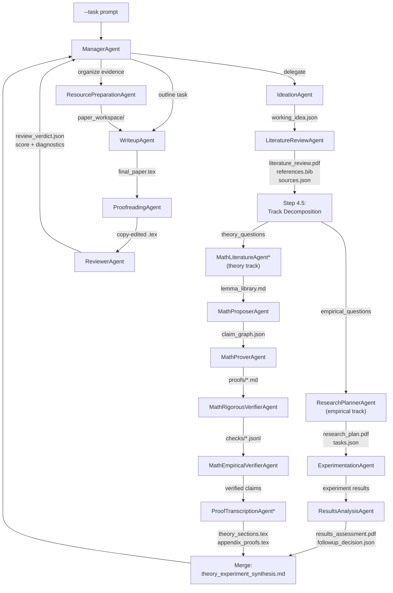
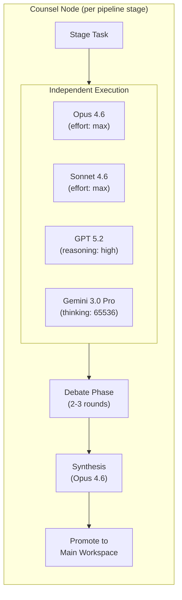

# freephdlabor: Multi-Agent Research-to-Paper Pipeline

`freephdlabor` is a local multi-agent research system that turns a research prompt into literature-grounded, experiment-backed, and (optionally) theorem-verified paper artifacts. It features **Model Counsel** -- a multi-model debate mechanism where top-tier LLMs independently work on each pipeline stage, then debate and synthesize a consensus output.

- License: MIT (`LICENSE`)
- Runtime: Python 3.11 (recommended via conda)
- Entry point: `launch_multiagent.py`
- Core package: `freephdlabor/`

## How It Works

You provide a research task. A ManagerAgent orchestrates specialist agents through a multi-phase pipeline that produces literature-grounded, evidence-backed paper artifacts. The orchestration layer is built on **LangGraph** (`StateGraph` with `SqliteSaver` checkpointing), which enables resumable runs and structured state transitions.

When **Model Counsel** is enabled (`--enable-counsel`), each pipeline stage is executed independently by four top-tier models (Claude Opus 4.6, Claude Sonnet 4.6, GPT 5.2, Gemini 3.0 Pro -- all with extended thinking enabled). The models then debate their outputs over multiple rounds until converging on a consensus result, which is promoted to the main workspace.

In `full_research` mode, the pipeline explicitly forks after the literature review into two tracks: an **empirical track** (experiments, data analysis) and a **theory track** (formal proofs, mathematical analysis via math agents). Both tracks merge before the final writeup.


The diagram above shows the `full_research` pipeline. In `default` mode, the manager has flexibility to pick agents adaptively. In `quick` mode, loops are shallower but truthfulness gates still apply.

## Quick Start

From repository root:

```bash
./scripts/bootstrap.sh researchlab full
conda activate researchlab
cp .env.example .env
# Edit .env and add at least one API key
python scripts/preflight_check.py --with-docs --with-web --with-experiment --with-latex
python launch_multiagent.py \
  --task "Investigate this topic and produce a paper draft with evidence-backed claims." \
  --pipeline-mode default \
  --no-log-to-files
```

Artifacts are written to `results/freephdlabor_<timestamp>/`.

## Installation (Detailed)

### Prerequisites

- macOS or Linux
- Conda (Miniconda or Anaconda)
- At least one LLM API key

### Alternative: Cross-Platform Conda Environment

For non-bash/non-macOS users (or if `bootstrap.sh` is not available), a minimal cross-platform spec is provided:

```bash
conda env create -f environment.cross-platform.yml
conda activate freephdlabor
```

This installs the core runtime without running bootstrap scripts.

### Bootstrap Profiles

Use:

```bash
./scripts/bootstrap.sh <env_name> <profile>
```

Supported profiles:

- `minimal`: core runtime
- `docs`: document/audio parsing stack
- `web`: web crawling stack + Playwright Chromium install
- `experiment`: experiment tool dependencies
- `latex`: TeX toolchain (`pdflatex`, `bibtex`)
- `full`: all capabilities

Profiles can be combined:

```bash
./scripts/bootstrap.sh researchlab minimal,web
```

### API Keys

Copy `.env.example` to `.env` and fill what you use:

```bash
OPENAI_API_KEY=your_openai_api_key_here
# Optional providers
# ANTHROPIC_API_KEY=...
# GOOGLE_API_KEY=...
# OPENROUTER_API_KEY=...
# DEEPSEEK_API_KEY=...
# XAI_API_KEY=...           # for Grok models (xAI)
# SERPER_API_KEY=...        # for OpenDeepSearch web search
# SEARXNG_INSTANCE_URL=...  # alternative search backend for OpenDeepSearch
```

**Model Counsel requirement**: When using `--enable-counsel`, all three provider keys are required: `OPENAI_API_KEY` (for GPT 5.2), `ANTHROPIC_API_KEY` (for Opus/Sonnet 4.6), and `GOOGLE_API_KEY` (for Gemini 3.0 Pro).

### Preflight Validation

```bash
python scripts/preflight_check.py --with-docs --with-web --with-experiment --with-latex
```

Remove flags for capabilities you did not install.

## Configuration

### Model Selection and Precedence

Model settings are resolved in this order:

1. Built-in defaults in `freephdlabor/runner.py` (`gpt-5`, `reasoning_effort=high`, `verbosity=medium`)
2. `.llm_config.yaml`
3. CLI overrides (`--model`, `--reasoning-effort`, `--verbosity`)

### `.llm_config.yaml`

This file controls:

- `main_agents` model + reasoning settings (`reasoning_effort`, `verbosity`, and Claude 4.6 `effort`)
- `run_experiment_tool` model settings for experiment subprocesses
- `counsel` model counsel configuration (models, debate rounds, synthesis model)
- `budget` hard USD cap and pricing map

Current repository defaults:

- `main_agents.model`: `claude-opus-4-6`
- `main_agents.effort`: `max` (this is "Opus 4.6 Max")
- `run_experiment_tool.code_model`: `gpt-5.3-codex`
- `run_experiment_tool.feedback_model`: `claude-sonnet-4-6`
- `run_experiment_tool.vlm_model`: `claude-sonnet-4-6`
- `run_experiment_tool.report_model`: `claude-opus-4-6`

### Model Counsel Configuration

The `counsel` section in `.llm_config.yaml` controls the multi-model debate feature:

```yaml
counsel:
  enabled: false
  max_debate_rounds: 3
  synthesis_model: claude-opus-4-6
  models:
    - model: claude-opus-4-6
      effort: max
    - model: claude-sonnet-4-6
      effort: max
    - model: gpt-5.2
      reasoning_effort: high
      verbosity: high
    - model: gemini-3.0-pro
      thinking_budget: 65536
```

When counsel is enabled, every specialist agent node in the pipeline becomes a counsel node. Each stage:

1. **Sandbox phase**: Each of the four models runs a full ReAct agent in an isolated workspace copy under `counsel_sandboxes/<agent>/model_<i>/`.
2. **Debate phase**: All outputs are collected and each model critiques the others via `litellm.completion()` for up to `max_debate_rounds` rounds.
3. **Synthesis phase**: The `synthesis_model` (default: Opus 4.6) produces a final consensus output from all debate context.
4. **Promotion phase**: Sandbox artifacts are merged back into the main workspace.

The manager node always uses a single model (the `main_agents.model`) and is not affected by counsel mode.

### Supported `--model` Values

From `freephdlabor/utils.py`:

- OpenAI: `gpt-5`, `gpt-5-mini`, `gpt-5-nano`, `gpt-5.2`, `gpt-5.3-codex`, `gpt-4o`, `gpt-4.1-mini-2025-04-14`, `o4-mini-2025-04-16`, `o3-2025-04-16`, `o3-pro-2025-06-10`
- Anthropic: `claude-opus-4-6`, `claude-sonnet-4-6`, `claude-opus-4-20250514`, `claude-sonnet-4-20250514`, `claude-sonnet-4-5`, `claude-sonnet-4-5-20250929`
- Google: `gemini-2.5-pro`, `gemini-2.5-flash`, `gemini-3.0-pro`
- DeepSeek: `deepseek-chat`, `deepseek-coder`
- xAI: `grok-4-0709`

Notes:

- "Opus 4.6 Max" is not a separate model ID. Use `claude-opus-4-6` with `effort: max` in `.llm_config.yaml`.
- `gpt-5.2` supports `reasoning_effort` and `verbosity` parameters (same as `gpt-5`).
- `gemini-3.0-pro` supports `thinking_budget` (default 65536 in counsel mode; 2M context window).

### Budget and Cost Controls

Budget enforcement is implemented in `freephdlabor/budget.py`.

- `budget.usd_limit`: hard spend cap
- `hard_stop: true`: blocks further calls after cap is reached
- `fail_closed: true`: blocks calls when usage cannot be priced
- `pricing`: per-model `input_per_1k` and `output_per_1k` token prices

Per-run budget files are written in workspace root:

- `budget_state.json`
- `budget_ledger.jsonl`
- `budget.lock` (when limit is reached)

**Counsel mode cost note**: When model counsel is enabled, each pipeline stage runs 4 independent ReAct agents plus multi-round debate, resulting in roughly 5-6x the LLM cost per stage. Adjust `budget.usd_limit` accordingly (600+ recommended for counsel mode with `full_research`).

### Token Tracking

Per-run token totals:

- `run_token_usage.json`

Private append-only local ledger:

- `.local/private_token_usage/api_token_calls.jsonl`
- `.local/private_token_usage/api_token_calls.txt`

Export a readable report:

```bash
python scripts/export_private_token_report.py
```

### Useful Environment Variables

- LaTeX overrides:
  - `FREEPHDLABOR_PDFLATEX_PATH`
  - `FREEPHDLABOR_BIBTEX_PATH`
- Logging/tracing:
  - `FREEPHDLABOR_LOG_TO_FILES` (default on)
  - `FREEPHDLABOR_ENABLE_TRACING=1` (optional Phoenix tracing)
  - `LANGCHAIN_TRACING_V2=true` + `LANGCHAIN_API_KEY=...` (optional LangSmith tracing)
- Agent behavior:
  - `FREEPHDLABOR_VLM_MODEL` -- VLM model used for document analysis (default: `claude-sonnet-4-5`)
  - `FREEPHDLABOR_ENABLE_MANAGER_TEXT_INSPECTOR` -- enable text inspector tool in manager (default: `1`)
  - `FREEPHDLABOR_WIPE_CONFIRM_TOKEN` -- required safety token for workspace wipe operations
  - `FREEPHDLABOR_COUNSEL_MAX_DEBATE_ROUNDS` -- override max debate rounds in counsel mode (set by runner from config/CLI)
- Citation retry controls:
  - `FREEPHDLABOR_SS_MAX_RETRIES`
  - `FREEPHDLABOR_SS_BASE_DELAY_SEC`
  - `FREEPHDLABOR_SS_COOLDOWN_SEC`
  - `FREEPHDLABOR_SS_TIMEOUT_SEC`
- Citation cache controls:
  - `FREEPHDLABOR_CITATION_CACHE_TTL_SEC`
  - `FREEPHDLABOR_CITATION_CACHE_MAX_ENTRIES`
- Tool output bounds:
  - `FREEPHDLABOR_SEE_FILE_MAX_CHARS`
  - `FREEPHDLABOR_SEARCH_MAX_CHARS`
  - `FREEPHDLABOR_SEARCH_MAX_MATCHES`

## Usage

### Pipeline Modes

| Mode | What it does | When to use |
|---|---|---|
| `default` | Baseline manager workflow (`Ideation -> Experimentation -> ResourcePreparation -> Writeup -> Proofreading -> Reviewer`) | Most day-to-day runs |
| `full_research` | Extended pipeline: decomposition, literature review, theory/experiment fork (Step 4.5), separate empirical planning (Step 5) and theory pipeline (Step 5T), execution, follow-up loop, merge, outline, full writeup | Best for serious paper generation |
| `quick` | Reduced-depth loops with core truthfulness gates | Fast exploratory passes |

In `full_research` mode, after the literature review the pipeline decomposes the research questions into an **empirical track** and a **theory track** (Step 4.5, producing `paper_workspace/track_decomposition.json`). The empirical track proceeds through research planning and experimentation. The theory track kicks off the math agent pipeline (MathLiterature -> MathProposer -> MathProver -> Verifiers -> ProofTranscription). Both tracks merge before the final outline and writeup.

### Common Run Commands

#### Default Mode

```bash
python launch_multiagent.py \
  --task "Investigate this direction and produce a draft with supporting evidence." \
  --pipeline-mode default
```

#### Full Research Mode (Strict)

```bash
python launch_multiagent.py \
  --task "Run the complete literature-plan-execution-writeup loop for this prompt." \
  --pipeline-mode full_research \
  --followup-max-iterations 3 \
  --enable-math-agents \
  --enforce-paper-artifacts \
  --enforce-editorial-artifacts \
  --min-review-score 8 \
  --require-pdf
```

#### Full Research with Model Counsel

```bash
python launch_multiagent.py \
  --task "Investigate this topic with multi-model consensus at every stage." \
  --pipeline-mode full_research \
  --enable-counsel \
  --enable-math-agents \
  --enforce-paper-artifacts \
  --require-pdf
```

This runs 4 models (Opus 4.6, Sonnet 4.6, GPT 5.2, Gemini 3.0 Pro) independently on each pipeline stage, then debates and synthesizes a consensus. Requires API keys for all three providers (`ANTHROPIC_API_KEY`, `OPENAI_API_KEY`, `GOOGLE_API_KEY`).

#### Quick Mode

```bash
python launch_multiagent.py \
  --task "Produce a fast exploratory pass of this topic." \
  --pipeline-mode quick
```

### Run the Provided Stable Task Templates

The repository includes staged tasks in `automation_tasks/`.

#### Step 1: Theory Task

```bash
python launch_multiagent.py \
  --pipeline-mode full_research \
  --enable-math-agents \
  --task "$(cat automation_tasks/run1_theory_task_stable.txt)"
```

#### Step 2: Experiment Task (resume same workspace)

```bash
python launch_multiagent.py \
  --resume /absolute/path/to/results/freephdlabor_<timestamp> \
  --pipeline-mode full_research \
  --task "$(cat automation_tasks/run2_experiment_task_stable.txt)"
```

#### Step 3: Paper Synthesis Task (resume same workspace)

```bash
python launch_multiagent.py \
  --resume /absolute/path/to/results/freephdlabor_<timestamp> \
  --pipeline-mode full_research \
  --task "$(cat automation_tasks/run3_paper_task_stable.txt)"
```

### Resume an Existing Workspace

```bash
python launch_multiagent.py \
  --resume /absolute/path/to/results/freephdlabor_<timestamp> \
  --task "Continue from current artifacts and improve the final deliverable."
```

### Provide Context Files (`.pdf`, `.md`, `.txt`)

```bash
mkdir -p /absolute/path/to/results/freephdlabor_<timestamp>/inputs
```

Put your files in that `inputs/` directory, then resume with a task that tells agents how to use them.

### Live Steering (Interrupt Without Restart)

Launcher opens a TCP socket at `127.0.0.1:5001` by default (`--callback_host`, `--callback_port`) and an HTTP REST server at port 5002 (one above the TCP port).

**TCP socket** (interactive terminal):

```bash
nc 127.0.0.1 5001
```

Then send:

1. `interrupt` (or `stop` / `pause`)
2. Your instruction
3. Empty line, empty line
4. `m` for modification or `n` for new task

**HTTP REST API** (programmatic / OpenClaw):

```bash
# Pause the pipeline
curl -s -X POST http://127.0.0.1:5002/interrupt

# Inject a steering instruction
curl -s -X POST http://127.0.0.1:5002/instruction \
     -H "Content-Type: application/json" \
     -d '{"text": "focus on linear case only", "type": "m"}'

# Check pause state and queue depth
curl -s http://127.0.0.1:5002/status
```

`type` is `"m"` (modify current task) or `"n"` (new task).

### Autonomous Campaign Manager (Multi-Stage Pipelines)

For multi-stage research campaigns (theory → experiments → paper), use the campaign manager. Define your campaign in `campaign.yaml`, then call the heartbeat script periodically:

```bash
# Initialise campaign state (safe to re-run)
python scripts/campaign_heartbeat.py --campaign campaign.yaml --init

# Tick the heartbeat (call every N minutes via cron / OpenClaw)
python scripts/campaign_heartbeat.py --campaign campaign.yaml

# Print current status
python scripts/campaign_heartbeat.py --campaign campaign.yaml --status
```

**Exit codes**: `0` = complete, `1` = in progress, `2` = failed (needs attention), `3` = just advanced.

The campaign manager:
- Checks whether the in-progress stage finished (by PID liveness + artifact presence)
- Advances to the next pending stage whose dependencies are all complete
- Distills completed stage artifacts into a `campaign_dir/memory/<stage_id>_summary.md` that is prepended to the next stage's task prompt
- Sends Slack/Telegram notifications on stage launch, completion, or failure

See `campaign.yaml` at the repo root for a complete three-stage muon regularization example.

### SLURM / HPC

Use `scripts/launch_multiagent_slurm.sh` as a template.

- Update `#SBATCH` values for your cluster
- Update conda env name if not `freephdlabor`
- Then submit with `sbatch scripts/launch_multiagent_slurm.sh [optional_launch_args]`

## CLI Reference

`python launch_multiagent.py --help`

| Flag | Default | Description |
|---|---|---|
| `--model` | `None` | Model for all agents (overrides `.llm_config.yaml`) |
| `--interpreter` | `python` | **Deprecated / no-op** — flag is accepted but ignored; the experiment tool auto-detects the interpreter via `sys.executable` |
| `--debug` | `false` | Enable debug logging |
| `--log-to-files` | env-driven | Force redirect stdout/stderr to `logs/freephdlabor_<timestamp>.{out,err}` |
| `--no-log-to-files` | env-driven | Disable file redirection |
| `--reasoning-effort` | `None` | GPT-5 reasoning level (`none|minimal|low|medium|high|xhigh`) |
| `--verbosity` | `None` | GPT-5 verbosity (`low|medium|high`) |
| `--callback_host` | `127.0.0.1` | Interruption socket host |
| `--callback_port` | `5001` | Interruption socket port |
| `--enable-planning` | `false` | **Deprecated / no-op** — flag is accepted for call-site compatibility but has no effect |
| `--planning-interval` | `3` | **Deprecated / no-op** — flag is accepted for call-site compatibility but has no effect |
| `--resume` | `None` | Resume existing workspace directory |
| `--task` | built-in default | Task string (required in practice for controlled runs) |
| `--manager-max-steps` | `None` (effective: `50`) | Override manager max step budget; `None` resolves to 50 at runtime |
| `--pipeline-mode` | `default` | `default`, `full_research`, or `quick` |
| `--followup-max-iterations` | `3` | Max Step 6 <-> 6.2 follow-up loops in `full_research` |
| `--enable-math-agents` | `false` | Enable theorem/proof pipeline agents |
| `--enforce-paper-artifacts` | `false` | Enforce required paper artifacts before success |
| `--require-pdf` | `false` | Require `final_paper.pdf` |
| `--require-experiment-plan` | `false` | Also require `experiments_to_run_later.md` when artifact checks are on |
| `--enforce-editorial-artifacts` | `false` | Enforce editorial workflow artifacts and verdict gates |
| `--min-review-score` | `8` | Minimum reviewer `overall_score` for strict editorial gate |
| `--enable-counsel` | `false` | Enable model counsel (multi-model debate at each pipeline stage) |
| `--no-counsel` | `false` | Disable counsel even if enabled in `.llm_config.yaml` |
| `--counsel-max-debate-rounds` | `None` (effective: `3`) | Override number of debate rounds in counsel mode |

Notes:

- `--enforce-paper-artifacts` can be auto-enabled if your `--task` text includes `final_paper` or `experiments_to_run_later`.
- LaTeX prerequisite checks are fail-fast when paper/editorial artifacts are required.
- `--enable-counsel` overrides the `counsel.enabled` setting in `.llm_config.yaml`. `--no-counsel` takes precedence over both.

## Writing Better `--task` Prompts

Good prompts include:

1. The core intuition/hypothesis
2. Desired output type (bound, theorem, ablation, benchmark, etc.)
3. Scope boundaries (what to include/exclude)
4. Evidence expectations (theory, experiments, both)

For math-heavy work, read `MATH_RESEARCH_PRIMER.md`.

## Understanding Results

Each run creates:

```text
results/freephdlabor_YYYYMMDD_HHMMSS/
  final_paper.tex
  final_paper.pdf                    # if generated/required
  paper_workspace/
    literature_review.pdf            # full_research
    research_plan.pdf                # full_research
    results_assessment.pdf           # full_research
    followup_decision.json           # full_research
    track_decomposition.json         # full_research: empirical/theory question split
    theory_experiment_synthesis.md   # full_research: merged theory+experiment results
    paper_outline.md                 # full_research
    references.bib
  math_workspace/                    # when --enable-math-agents
    claim_graph.json
    proofs/
    checks/
    lemma_library.md
  counsel_sandboxes/                 # when --enable-counsel
    <agent_name>/
      model_0_claude-opus-4-6/
      model_1_claude-sonnet-4-6/
      model_2_gpt-5.2/
      model_3_gemini-3.0-pro/
  inter_agent_messages/
  run_token_usage.json
  budget_state.json                  # when budget.usd_limit is configured
  budget_ledger.jsonl                # when budget.usd_limit is configured
  checkpoints.db                     # LangGraph SqliteSaver checkpoint database
  memory_backup/
    full_conversation_backup.jsonl   # messages dropped by context compaction
  <agent_name>/
```

### What to Inspect First

1. `final_paper.tex` / `final_paper.pdf`
2. `paper_workspace/track_decomposition.json` (in `full_research` -- shows the empirical/theory split)
3. `paper_workspace/followup_decision.json` (in `full_research`)
4. `math_workspace/claim_graph.json` (if math agents are enabled)
5. `math_workspace/checks/*.jsonl` for symbolic/numeric verification evidence
6. `counsel_sandboxes/` to inspect individual model outputs before consensus (if counsel enabled)
7. `run_token_usage.json` and `budget_ledger.jsonl` for cost/usage accounting

## Quality Gates and Artifact Contracts

### Required Artifacts (manager-side enforcement)

When enabled, manager checks for:

- Base paper gate: `final_paper.tex`
- Optional strict additions:
  - `final_paper.pdf` (with `--require-pdf`)
  - `experiments_to_run_later.md` (with `--require-experiment-plan`)
- In `full_research`, additional required artifacts:
  - `paper_workspace/literature_review.pdf`
  - `paper_workspace/research_plan.pdf`
  - `paper_workspace/results_assessment.pdf`
  - `paper_workspace/followup_decision.json`
  - `paper_workspace/track_decomposition.json`
- With `--enforce-editorial-artifacts`, additional outputs:
  - `paper_workspace/author_style_guide.md`
  - `paper_workspace/intro_skeleton.tex`
  - `paper_workspace/style_macros.tex`
  - `paper_workspace/reader_contract.json`
  - `paper_workspace/editorial_contract.md`
  - `paper_workspace/theorem_map.json`
  - `paper_workspace/revision_log.md`
  - `paper_workspace/copyedit_report.md`
  - `paper_workspace/review_report.md`
  - `paper_workspace/review_verdict.json`
  - `paper_workspace/claim_traceability.json` (if math agents also enabled)

### Additional Strict Validations

- Review verdict gate (`overall_score >= --min-review-score`, no hard blockers)
- Paper quality validation
- Math acceptance and dependency consistency
- Claim traceability audit (when editorial + math mode are active)

## Architecture (Contributor View)

The system uses **LangGraph** as its orchestration framework. `freephdlabor/graph.py` builds a `StateGraph` with `SqliteSaver` checkpointing (persisted to `checkpoints.db`), and `freephdlabor/state.py` defines the `ResearchState` TypedDict that flows between nodes. When counsel is enabled, `freephdlabor/counsel.py` wraps each specialist node to run 4 models independently before debate and synthesis.

### Agent Orchestration (Data Flow)

In `full_research` mode, the pipeline forks after literature review into empirical and theory tracks:



### Model Counsel (When Enabled)

When `--enable-counsel` is active, each specialist node in the graph above is replaced by a counsel node:



Each model works in an isolated sandbox directory. After independent execution, all outputs are debated across multiple rounds until the synthesis model produces a consensus result.

### Claim Status Progression (Theory Pipeline)

```
proposed --> proved_draft --> verified_symbolic --> verified_numeric --> accepted
                  ^                                       |
                  |              (demoted on failure)     |
                  +---------------------------------------+
```

Claims reaching `accepted` appear as derived results in the paper. Non-accepted claims are labeled as conjectures.

> **Math agent availability**: When `--enable-math-agents` is set, the core agents (`MathProposerAgent`, `MathProverAgent`, `MathRigorousVerifierAgent`, `MathEmpiricalVerifierAgent`) are active in all pipeline modes. `MathLiteratureAgent` and `ProofTranscriptionAgent` (marked `*` in the diagram above) are only added in `full_research` mode.

### Module Map

| Module | Purpose |
|---|---|
| `launch_multiagent.py` | Thin entry point (`freephdlabor.runner.main`) |
| `freephdlabor/runner.py` | Run lifecycle: setup, config, model, counsel init, artifacts, execution |
| `freephdlabor/args.py` | CLI argument definitions (including counsel flags) |
| `freephdlabor/config.py` | `.llm_config.yaml` loading and provider parameter filtering |
| `freephdlabor/utils.py` | Model construction helpers (`create_model`), supported model registry (`AVAILABLE_MODELS`), and graph build wrapper |
| `freephdlabor/llm.py` | Vision-language utility functions for direct OpenAI/Anthropic multimodal calls used by document/figure analysis tools |
| `freephdlabor/counsel.py` | Model counsel: multi-model sandbox execution, debate, synthesis, and artifact promotion |
| `freephdlabor/prereqs.py` | LaTeX binary resolution and guidance |
| `freephdlabor/budget.py` | Budget enforcement wrappers and ledgers |
| `freephdlabor/token_usage_tracker.py` | Run-scoped and private token usage tracking |
| `freephdlabor/graph.py` | LangGraph `StateGraph` definition and node wiring (counsel-aware) |
| `freephdlabor/state.py` | `ResearchState` TypedDict flowing between graph nodes (includes theory/experiment track fields) |
| `freephdlabor/context_compaction.py` | `trim_messages`-based context compaction for long-running sessions; backs up dropped messages to `memory_backup/full_conversation_backup.jsonl` |
| `freephdlabor/prompts/` | System prompts and instruction templates for manager and specialist agents |
| `freephdlabor/interaction/` | Live-steering TCP socket + HTTP REST server (`http_steering.py`) for interrupt/modification handling |
| `freephdlabor/campaign/` | Autonomous multi-stage campaign manager: spec loader, status tracker, stage launcher, cross-run memory distillation, notifications |
| `scripts/campaign_heartbeat.py` | OpenClaw entrypoint: heartbeat tick that checks stage completion, advances campaign, and sends notifications |
| `freephdlabor/interpreters/` | Workspace-scoped Python execution helpers used by code execution tooling |
| `freephdlabor/logging/` | LLM call logging callback handlers that write workspace-scoped JSONL traces |
| `freephdlabor/supervision/` | Validation gates (artifacts, reviews, traceability, math acceptance) |
| `freephdlabor/agents/` | Manager + specialist agent implementations (counsel-aware `build_node()`) |
| `freephdlabor/toolkits/` | Tool implementations used by agents |

### Toolkit Groups

| Directory | Contains |
|---|---|
| `toolkits/search/` | arXiv tools, OpenDeepSearch, browser/text inspection, VQA |
| `toolkits/filesystem/` | file editing, knowledge-base/repo tools |
| `toolkits/ideation/` | idea generation, novelty check, paper search |
| `toolkits/experimentation/` | experiment execution and idea standardization |
| `toolkits/writeup/` | LaTeX generation/compilation, citation, plotting |
| `toolkits/math/` | claim graph, proof workspace, symbolic rigor, numeric verification |
| `toolkits/communication/` | `talk_to_user` tool |

## Math Research Workflow

For deep usage guidance, see `MATH_RESEARCH_PRIMER.md`.

Common math artifacts:

- `math_workspace/claim_graph.json`
- `math_workspace/proofs/<claim_id>.md`
- `math_workspace/checks/<claim_id>.jsonl`
- `math_workspace/lemma_library.md`

Lemma library CLI:

```bash
python scripts/lemma_library_cli.py --workspace /absolute/path/to/results/freephdlabor_<timestamp>/math_workspace list
python scripts/lemma_library_cli.py --workspace /absolute/path/to/results/freephdlabor_<timestamp>/math_workspace get --lemma-id L_smooth_descent_standard
python scripts/lemma_library_cli.py --workspace /absolute/path/to/results/freephdlabor_<timestamp>/math_workspace upsert --lemma-id L_smooth_descent_standard --statement "For L-smooth f, gradient step gives standard descent bound."
python scripts/lemma_library_cli.py --workspace /absolute/path/to/results/freephdlabor_<timestamp>/math_workspace touch --lemma-id L_smooth_descent_standard
```

## Runtime and Cost Expectations

Runtime and cost depend heavily on task scope, enabled tools, model choice, and how many revision loops are needed.

- `quick` mode is usually the fastest
- `default` mode often runs longer because of iterative reviewer loops
- `full_research` + math + PDF compilation can be substantially longer and more expensive
- `--enable-counsel` multiplies per-stage cost by roughly 5-6x (4 independent model runs + multi-round debate + synthesis). A full_research run with counsel and math agents can cost significantly more than a single-model run. Increase `budget.usd_limit` to 600+ when using counsel mode.

Control spend explicitly with `.llm_config.yaml` budget settings and monitor:

- `run_token_usage.json`
- `budget_ledger.jsonl`

## Troubleshooting

### `ModuleNotFoundError` (`yaml`, `smolagents`, `litellm`, etc.)

```bash
./scripts/bootstrap.sh researchlab minimal
conda activate researchlab
python scripts/preflight_check.py
```

### Missing web dependency (`crawl4ai`, etc.)

```bash
./scripts/bootstrap.sh researchlab web
```

### Playwright Chromium missing

```bash
python -m playwright install chromium
```

### LaTeX tools missing (`pdflatex` / `bibtex`)

```bash
./scripts/bootstrap.sh researchlab latex
python scripts/preflight_check.py --with-latex
```

If conda TeX formats are broken:

```bash
./scripts/fix_pdflatex_conda.sh researchlab
```

### `pydub` warning about `ffmpeg`

```bash
brew install ffmpeg
```

### No API key detected

Check `.env` and shell environment variables (`OPENAI_API_KEY`, etc.).

### Reduce citation retries / token burn

```bash
export FREEPHDLABOR_SS_MAX_RETRIES=2
export FREEPHDLABOR_SS_BASE_DELAY_SEC=2
export FREEPHDLABOR_SS_COOLDOWN_SEC=60
```

### Limit oversized tool outputs

```bash
export FREEPHDLABOR_SEE_FILE_MAX_CHARS=12000
export FREEPHDLABOR_SEARCH_MAX_CHARS=12000
export FREEPHDLABOR_SEARCH_MAX_MATCHES=200
```

## Running Tests

```bash
pytest tests/
```

Current deterministic test modules:

- `tests/test_validation.py`
- `tests/test_config.py`
- `tests/test_prereqs.py`

## Repository Hygiene

- Keep generated outputs and local runtime state out of version control (`results/`, `logs/`, `.env`, caches)
- Before pushing changes:

```bash
git status -sb
```

## License

MIT. See `LICENSE`. Copyright (c) 2025 Tianjin Li and Junyu Ren.
