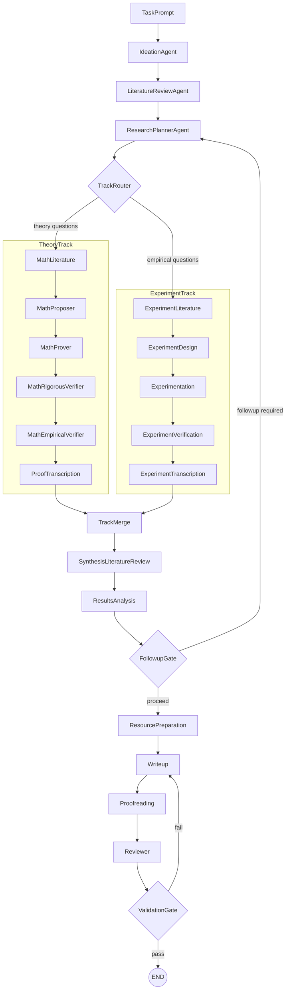
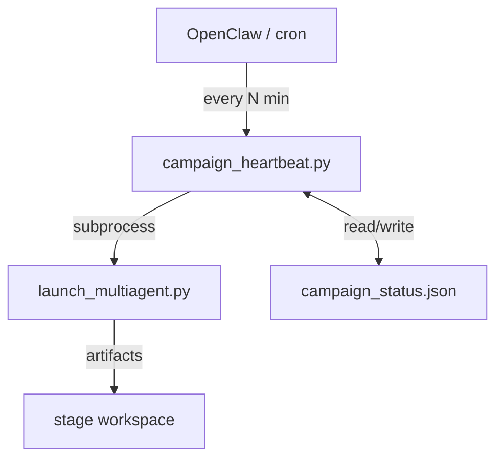

# consortium: Multi-Agent Research-to-Paper Pipeline

`consortium` is a local agentic research platform that turns a research prompt into literature-grounded, experiment-backed, and optionally theorem-verified paper artifacts.

- License: MIT (`LICENSE`)
- Runtime: Python 3.11 (recommended via conda)
- Entry point: `launch_multiagent.py`
- Core package: `consortium/`

> Runtime note: the launcher now runs a deterministic full pipeline. `--pipeline-mode` is accepted for backward compatibility but ignored.

---

## 5-Minute Quickstart

> **Cost**: ~$2–10 (single model, no counsel) | **Time**: 15–40 min | **Requires**: one API key

```bash
# 1. Bootstrap environment (one-time, ~5 min)
./scripts/bootstrap.sh researchlab minimal

conda activate researchlab

# 2. Set your API key (only one provider needed)
cp .env.example .env
echo "ANTHROPIC_API_KEY=your_key_here" >> .env   # or OPENAI_API_KEY / GOOGLE_API_KEY

# 3. Validate setup without spending tokens
python launch_multiagent.py --task "test" --dry-run

# 4. Run the included quickstart example (~$3, produces markdown paper draft)
python launch_multiagent.py \
  --task "$(cat examples/quickstart/task.txt)" \
  --output-format markdown \
  --no-counsel \
  --no-log-to-files
```

After the run, look in `results/consortium_<timestamp>/` for:
- `final_paper.md` — the generated paper draft
- `paper_workspace/literature_review.pdf` — literature synthesis
- `budget_state.json` — total tokens and cost used

**Want a full paper with LaTeX/PDF?** Install LaTeX (`./scripts/bootstrap.sh researchlab latex`) and drop `--output-format markdown`.

**Want multi-model quality?** Add `--enable-counsel` (requires OpenAI + Anthropic + Google keys; ~4× cost).

**Want math theorem verification?** Add `--enable-math-agents` (see [Math Workflow](#math-workflow)).

---

## Table of Contents

- [What This Platform Does](#what-this-platform-does)
- [How the Pipeline Works](#how-the-pipeline-works)
- [Quick Start](#quick-start)
- [Installation (Detailed)](#installation-detailed)
- [Configuration](#configuration)
- [Common Run Commands](#common-run-commands)
- [Resume and Stage-Based Resume](#resume-and-stage-based-resume)
- [Stable Task Templates](#stable-task-templates)
- [Live Steering During a Run](#live-steering-during-a-run)
- [OpenClaw / Campaign Orchestration](#openclaw-campaign-orchestration)
- [CLI Reference](#cli-reference)
- [Understanding Outputs](#understanding-outputs)
- [Quality Gates and Artifact Contracts](#quality-gates-and-artifact-contracts)
- [Architecture and Module Map](#architecture-and-module-map)
- [Math Workflow](#math-workflow)
- [Runtime and Cost Expectations](#runtime-and-cost-expectations)
- [Troubleshooting](#troubleshooting)
- [Running Tests](#running-tests)
- [License](#license)

## What This Platform Does

Given a `--task`, the active single-run LangGraph workflow:

1. Explores the problem through ideation and literature review
2. Builds a research plan and writes `paper_workspace/track_decomposition.json`
3. Launches the theory track, experiment track, or both in parallel based on that decomposition
4. Merges and synthesizes track outputs, then runs results analysis and a follow-up decision
5. Loops back to planning when more theory or experiments are needed
6. Prepares resources, writes the paper, proofreads it, reviews it, and runs final validation gates
7. Optionally enables theorem/proof work via `--enable-math-agents`
8. Optionally enables multi-model debate at each specialist stage via `--enable-counsel`
9. Supports autonomous multi-stage campaigns via OpenClaw or cron (`OpenClaw_Use_Guide.md`)

Runs are resumable through LangGraph checkpoints (`checkpoints.db`) and can be steered live over TCP/HTTP.

## How the Pipeline Works

### Phase-Based Execution Graph

The single-run pipeline is a direct-wired LangGraph workflow, not a manager hub and not a purely linear stage list. It executes in five phases:

**1. Discovery**
- `ideation_agent`
- `literature_review_agent`
- `research_planner_agent`

The planner produces `paper_workspace/track_decomposition.json`, which contains:
- `theory_questions`
- `empirical_questions`
- `recommended_track`
- `rationale`

**2. Parallel Track Execution**
- **Theory track** (when `--enable-math-agents` is enabled and the planner selects theory work):
  - `math_literature_agent`
  - `math_proposer_agent`
  - `math_prover_agent`
  - `math_rigorous_verifier_agent`
  - `math_empirical_verifier_agent`
  - `proof_transcription_agent`
- **Experiment track** (when the planner selects empirical work):
  - `experiment_literature_agent`
  - `experiment_design_agent`
  - `experimentation_agent`
  - `experiment_verification_agent`
  - `experiment_transcription_agent`

**3. Merge And Interpretation**
- `track_merge`
- `synthesis_literature_review_agent`
- `results_analysis_agent`

**4. Follow-Up Loop**
- `followup_gate` sends control back to `research_planner_agent` when more theory or experiments are needed
- otherwise the run proceeds to paper production

**5. Paper Production And Final QA**
- `resource_preparation_agent`
- `writeup_agent`
- `proofreading_agent`
- `reviewer_agent`
- `validation_gate`



If the planner selects no execution tracks, the graph falls through directly to `track_merge`, then continues through synthesis and results analysis.

When counsel is enabled, each specialist node runs multiple independent model executions, then a debate + synthesis round before promoting consensus artifacts.

## Quick Start

From repository root (`consortium`):

```bash
./scripts/bootstrap.sh researchlab full
conda activate researchlab
cp .env.example .env
# Edit .env and add at least one API key
python scripts/preflight_check.py --with-docs --with-web --with-experiment --with-latex

# Recommended first run (single-model, lower cost):
python launch_multiagent.py \
  --task "Investigate this topic and produce a paper draft with evidence-backed claims." \
  --no-counsel \
  --no-log-to-files
```

Artifacts are written to `results/consortium_<timestamp>/`.

## Installation (Detailed)

### Prerequisites

- macOS or Linux
- Conda (Miniconda or Anaconda)
- At least one LLM API key

### Standard Bootstrap

```bash
./scripts/bootstrap.sh <env_name> <profile>
```

Supported profiles:

- `minimal`: core runtime
- `docs`: document/audio parsing stack
- `web`: web crawling stack + Playwright Chromium install
- `experiment`: experiment tool dependencies
- `latex`: TeX toolchain (`pdflatex`, `bibtex`)
- `full`: all capabilities

Profiles can be combined:

```bash
./scripts/bootstrap.sh researchlab minimal,web
```

### Alternative: Cross-Platform Conda Spec

```bash
conda env create -f environment.cross-platform.yml
conda activate consortium
```

This installs the core runtime without running bootstrap scripts.

### API Keys (`.env`)

Copy `.env.example` to `.env` and fill the providers you use:

```bash
OPENAI_API_KEY=your_openai_api_key_here
# ANTHROPIC_API_KEY=your_anthropic_api_key_here
# GOOGLE_API_KEY=your_google_api_key_here
# OPENROUTER_API_KEY=your_openrouter_api_key_here
# DEEPSEEK_API_KEY=your_deepseek_api_key_here
# XAI_API_KEY=your_xai_api_key_here
# SERPER_API_KEY=your_serper_api_key_here
# SEARXNG_INSTANCE_URL=https://your-searxng-instance
```

Counsel mode requires:

- `OPENAI_API_KEY`
- `ANTHROPIC_API_KEY`
- `GOOGLE_API_KEY`

### Preflight Validation

```bash
python scripts/preflight_check.py --with-docs --with-web --with-experiment --with-latex
```

Remove flags for capabilities you did not install.

## Configuration

### Model Selection Precedence

Model settings are resolved in this order:

1. Built-in defaults in `consortium/runner.py` (`gpt-5`, `reasoning_effort=high`, `verbosity=medium`)
2. `.llm_config.yaml`
3. CLI overrides (`--model`, `--reasoning-effort`, `--verbosity`)

### `.llm_config.yaml` (Current Repository Defaults)

Current values in this repo:

- `main_agents.model`: `claude-opus-4-6`
- `main_agents.reasoning_effort`: `high`
- `main_agents.verbosity`: `medium`
- `main_agents.effort`: currently commented out in config
- `run_experiment_tool.code_model`: `gpt-5.2`
- `run_experiment_tool.feedback_model`: `claude-sonnet-4-6`
- `run_experiment_tool.vlm_model`: `claude-sonnet-4-6`
- `run_experiment_tool.report_model`: `claude-opus-4-6`
- `budget.usd_limit`: `600`
- `counsel.enabled`: `true`
- `counsel.max_debate_rounds`: `3`

Counsel precedence:

- `--no-counsel` disables counsel even if enabled in config
- `--enable-counsel` enables counsel even if disabled in config
- If neither flag is passed, config value is used

### Supported `--model` Values

From `consortium/utils.py`:

- OpenAI: `gpt-5`, `gpt-5-mini`, `gpt-5-nano`, `gpt-5.2`, `gpt-5.3-codex`, `gpt-4o`, `gpt-4.1-mini-2025-04-14`, `o4-mini-2025-04-16`, `o3-2025-04-16`, `o3-pro-2025-06-10`
- Anthropic: `claude-opus-4-6`, `claude-sonnet-4-6`, `claude-opus-4-20250514`, `claude-sonnet-4-20250514`, `claude-sonnet-4-5`, `claude-sonnet-4-5-20250929`
- Google: `gemini-2.5-pro`, `gemini-2.5-flash`, `gemini-3.0-pro`
- DeepSeek: `deepseek-chat`, `deepseek-coder`
- xAI: `grok-4-0709`

### Budget and Token Tracking

Budget files in each workspace:

- `budget_state.json`
- `budget_ledger.jsonl`
- `budget.lock` (present when cap is reached)

Token files:

- `run_token_usage.json`
- `.local/private_token_usage/api_token_calls.jsonl`
- `.local/private_token_usage/api_token_calls.txt`

Export private report:

```bash
python scripts/export_private_token_report.py
```

### Useful Environment Variables

- LaTeX overrides: `CONSORTIUM_PDFLATEX_PATH`, `CONSORTIUM_BIBTEX_PATH`
- Logging/tracing: `CONSORTIUM_LOG_TO_FILES`, `CONSORTIUM_ENABLE_TRACING`, `LANGCHAIN_TRACING_V2`, `LANGCHAIN_API_KEY`
- Agent behavior: `CONSORTIUM_VLM_MODEL`, `CONSORTIUM_ENABLE_MANAGER_TEXT_INSPECTOR`, `CONSORTIUM_WIPE_CONFIRM_TOKEN`
- Counsel override: `CONSORTIUM_COUNSEL_MAX_DEBATE_ROUNDS`
- Citation controls: `CONSORTIUM_SS_MAX_RETRIES`, `CONSORTIUM_SS_BASE_DELAY_SEC`, `CONSORTIUM_SS_COOLDOWN_SEC`, `CONSORTIUM_SS_TIMEOUT_SEC`
- Cache controls: `CONSORTIUM_CITATION_CACHE_TTL_SEC`, `CONSORTIUM_CITATION_CACHE_MAX_ENTRIES`
- Tool output bounds: `CONSORTIUM_SEE_FILE_MAX_CHARS`, `CONSORTIUM_SEARCH_MAX_CHARS`, `CONSORTIUM_SEARCH_MAX_MATCHES`

## Common Run Commands

### Basic Run (Recommended First Run)

```bash
python launch_multiagent.py \
  --task "Investigate this direction and produce a draft with supporting evidence." \
  --no-counsel
```

### Strict Paper Run

```bash
python launch_multiagent.py \
  --task "Run the full literature-to-paper workflow with strict artifact checks." \
  --no-counsel \
  --followup-max-iterations 3 \
  --enforce-paper-artifacts \
  --enforce-editorial-artifacts \
  --min-review-score 8 \
  --require-pdf
```

### Run with Math Agents

```bash
python launch_multiagent.py \
  --task "Include theorem/proof work and integrate accepted claims into the paper." \
  --enable-math-agents \
  --no-counsel
```

### Run with Model Counsel

```bash
python launch_multiagent.py \
  --task "Run each specialist stage with multi-model debate and synthesis." \
  --enable-counsel \
  --enable-math-agents \
  --enforce-paper-artifacts \
  --require-pdf
```

Counsel runs are much more expensive (roughly 5-6x per specialist stage).

## Resume and Stage-Based Resume

### Resume a Workspace

```bash
python launch_multiagent.py \
  --resume /absolute/path/to/results/consortium_<timestamp> \
  --task "Continue from current artifacts and improve the final deliverable."
```

### Start From a Specific Stage

`--start-from-stage` requires `--resume`:

```bash
python launch_multiagent.py \
  --resume /absolute/path/to/results/consortium_<timestamp> \
  --start-from-stage experimentation \
  --task "Re-run experimentation and downstream stages with tighter controls." \
  --no-counsel
```

Accepted names include canonical IDs and common aliases, for example:

- `ideation`, `literature_review`, `planning`, `experimentation`, `results_analysis`
- `resource_preparation`, `writeup`, `proofreading`, `reviewer`
- math aliases like `math_prover`, `math_rigorous_verifier`, `proof_transcription` (when math agents are enabled)

### Provide Context Files (`.pdf`, `.md`, `.txt`)

```bash
mkdir -p /absolute/path/to/results/consortium_<timestamp>/inputs
```

Put your files in `inputs/`, then resume with a task that tells agents how to use them.

## Stable Task Templates

The repo includes staged task templates under `automation_tasks/`.

### Step 1: Theory Task

```bash
python launch_multiagent.py \
  --enable-math-agents \
  --no-counsel \
  --task "$(cat automation_tasks/run1_theory_task_stable.txt)"
```

### Step 2: Experiment Task (resume same workspace)

```bash
python launch_multiagent.py \
  --resume /absolute/path/to/results/consortium_<timestamp> \
  --no-counsel \
  --task "$(cat automation_tasks/run2_experiment_task_stable.txt)"
```

### Step 3: Paper Task (resume same workspace)

```bash
python launch_multiagent.py \
  --resume /absolute/path/to/results/consortium_<timestamp> \
  --no-counsel \
  --task "$(cat automation_tasks/run3_paper_task_stable.txt)"
```

These templates define a **campaign-style multi-run workflow** (`theory -> experiment -> paper`). That campaign-level sequencing is separate from the **single-run internal graph**, which now does planner-driven parallel theory/experiment routing inside one run.

## Live Steering During a Run

Launcher opens:

- TCP control socket at `--callback_host:--callback_port` (default `127.0.0.1:5001`)
- HTTP steering API at `callback_port + 1` (default `5002`)

### TCP Steering

```bash
nc 127.0.0.1 5001
```

Then send:

1. `interrupt` (or `stop` / `pause`)
2. Your instruction
3. Empty line, empty line
4. `m` (modify current task) or `n` (new task)

### HTTP Steering

```bash
# Pause
curl -s -X POST http://127.0.0.1:5002/interrupt

# Inject instruction
curl -s -X POST http://127.0.0.1:5002/instruction \
  -H "Content-Type: application/json" \
  -d '{"text":"focus on linear case only","type":"m"}'

# Check status
curl -s http://127.0.0.1:5002/status
```

## OpenClaw Campaign Orchestration

OpenClaw is an external scheduler/orchestrator for running `consortium` as a multi-stage campaign. In practice, OpenClaw (or cron) repeatedly calls `scripts/campaign_heartbeat.py`, and that heartbeat script manages stage launches, completion checks, and transitions.



### Integration Surfaces

1. **Campaign heartbeat (scheduling + stage advancement)**  
   OpenClaw calls `scripts/campaign_heartbeat.py` on an interval.

2. **HTTP steering API (mid-run control)**  
   While a stage is running, OpenClaw can pause and inject instructions through the REST API (`/interrupt`, `/instruction`, `/status`) on `callback_port + 1` (default `5002`).

### Heartbeat Commands

```bash
# Initialize campaign state (safe to re-run)
python scripts/campaign_heartbeat.py --campaign campaign.yaml --init

# Heartbeat tick (call every N minutes from OpenClaw/cron)
python scripts/campaign_heartbeat.py --campaign campaign.yaml

# Show status
python scripts/campaign_heartbeat.py --campaign campaign.yaml --status

# Optional: force advance
python scripts/campaign_heartbeat.py --campaign campaign.yaml --force-advance
```

### Heartbeat Exit Codes

| Code | Meaning | Orchestrator action |
|---|---|---|
| `0` | Campaign complete | Stop scheduling |
| `1` | In progress / no action this tick | Keep scheduling |
| `2` | Stage failed | Pause scheduling and alert operator |
| `3` | Stage advanced this tick | Continue scheduling (often with a shorter next interval) |

### HTTP Steering Quick Reference

```bash
# Pause running stage
curl -s -X POST http://127.0.0.1:5002/interrupt

# Inject instruction
curl -s -X POST http://127.0.0.1:5002/instruction \
  -H "Content-Type: application/json" \
  -d '{"text":"focus on linear case only","type":"m"}'

# Check paused status + queue depth
curl -s http://127.0.0.1:5002/status
```

For complete campaign configuration, task file authoring, failure recovery, and notification setup, see `OpenClaw_Use_Guide.md`.

The included `campaign.yaml` may contain legacy `--pipeline-mode` args; they are accepted for compatibility but ignored by current launcher behavior.

OpenClaw sequencing is at the **campaign/workspace** level. Each launched run still uses the internal single-run graph documented above, including parallel track routing, follow-up replanning, and the final validation loop.

### SLURM / HPC

Use `scripts/launch_multiagent_slurm.sh` as a template:

```bash
sbatch scripts/launch_multiagent_slurm.sh [optional_launch_args]
```

## CLI Reference

Use `python launch_multiagent.py --help` for full output.

| Flag | Default | Description |
|---|---|---|
| `--model` | `None` | Model override for all agents |
| `--interpreter` | `python` | Deprecated/no-op (accepted for compatibility) |
| `--debug` | `false` | Enable debug logging |
| `--log-to-files` | env-driven | Force stdout/stderr redirection to `logs/` |
| `--no-log-to-files` | env-driven | Disable file redirection |
| `--reasoning-effort` | `None` | GPT-5 reasoning level (`none|minimal|low|medium|high|xhigh`) |
| `--verbosity` | `None` | GPT-5 verbosity (`low|medium|high`) |
| `--callback_host` | `127.0.0.1` | Interrupt socket host |
| `--callback_port` | `5001` | Interrupt socket port (HTTP is `port + 1`) |
| `--enable-planning` | `false` | Deprecated/no-op |
| `--planning-interval` | `3` | Deprecated/no-op |
| `--resume` | `None` | Resume existing workspace |
| `--start-from-stage` | `None` | Start from a specific stage (requires `--resume`) |
| `--task` | built-in default | Task prompt |
| `--manager-max-steps` | `None` (effective `50`) | Legacy compatibility field retained in run state; not the primary routing control in the current direct-wired graph |
| `--pipeline-mode` | `None` | Deprecated/ignored; deterministic full pipeline always used |
| `--followup-max-iterations` | `3` | Max follow-up loops in deterministic pipeline |
| `--enable-math-agents` | `false` | Enable theorem/proof pipeline |
| `--enforce-paper-artifacts` | `false` | Require paper artifact contract before success |
| `--require-pdf` | `false` | Require `final_paper.pdf` |
| `--require-experiment-plan` | `false` | Also require `experiments_to_run_later.md` when paper artifacts are enforced |
| `--enforce-editorial-artifacts` | `false` | Enforce editorial workflow artifacts and review gate |
| `--min-review-score` | `8` | Minimum reviewer score for strict gate |
| `--enable-counsel` | `false` | Force-enable multi-model counsel |
| `--no-counsel` | `false` | Force-disable counsel |
| `--counsel-max-debate-rounds` | `None` (effective `3`) | Override counsel debate rounds |

Notes:

- `--enforce-paper-artifacts` can auto-enable when the task mentions `final_paper` or `experiments_to_run_later`.
- LaTeX prerequisites are checked fail-fast when PDF/editorial gating is enabled.

## Understanding Outputs

Typical run structure:

```text
results/consortium_YYYYMMDD_HHMMSS/
  final_paper.tex
  final_paper.pdf                    # if generated/required
  paper_workspace/
    literature_review.pdf
    research_plan.pdf
    research_plan_tasks.json
    research_plan_risk_register.md
    results_assessment.pdf
    followup_decision.json
    followup_literature_notes.md
    track_decomposition.json
    experiment_report.tex            # when experiment transcription runs
    experiment_report.pdf            # when experiment transcription runs
    resource_inventory.pdf           # when resource preparation runs
    references.bib
  experiment_workspace/
    experiment_literature.md
    experiment_baselines.json
    experiment_design.json
    experiment_rationale.md
    execution_log.json
    verification_report.md
    verification_results.json
  experiment_runs/
    <uuid>/
      experiments/
        <timestamp>_<experiment_name>/
  math_workspace/                    # when --enable-math-agents
    claim_graph.json
    proofs/
    checks/
    lemma_library.md
  counsel_sandboxes/                 # when counsel is enabled
    <agent_name>/
      model_0_claude-opus-4-6/
      model_1_claude-sonnet-4-6/
      model_2_gpt-5.2/
      model_3_gemini-3.0-pro/
  inter_agent_messages/
  run_token_usage.json
  budget_state.json                  # when budget is configured
  budget_ledger.jsonl                # when budget is configured
  checkpoints.db
  memory_backup/
    full_conversation_backup.jsonl
  <agent_name>/
```

What to inspect first:

1. `final_paper.tex` / `final_paper.pdf`
2. `paper_workspace/track_decomposition.json`
3. `experiment_workspace/experiment_design.json` and `experiment_workspace/verification_results.json`
4. `paper_workspace/followup_decision.json`
5. `math_workspace/claim_graph.json` and `math_workspace/checks/*.jsonl` (if math enabled)
6. `run_token_usage.json` and `budget_ledger.jsonl`

## Quality Gates and Artifact Contracts

When `--enforce-paper-artifacts` is active, the final validation gate checks for:

- `final_paper.tex`
- `paper_workspace/track_decomposition.json`
- `paper_workspace/literature_review.pdf`
- `paper_workspace/research_plan.pdf`
- `paper_workspace/results_assessment.pdf`
- `paper_workspace/followup_decision.json`
- optionally `final_paper.pdf` (`--require-pdf`)
- optionally `experiments_to_run_later.md` (`--require-experiment-plan`)

Additional strict checks with `--enforce-editorial-artifacts` include:

- `paper_workspace/author_style_guide.md`
- `paper_workspace/intro_skeleton.tex`
- `paper_workspace/style_macros.tex`
- `paper_workspace/reader_contract.json`
- `paper_workspace/editorial_contract.md`
- `paper_workspace/theorem_map.json`
- `paper_workspace/revision_log.md`
- `paper_workspace/copyedit_report.md`
- `paper_workspace/review_report.md`
- `paper_workspace/review_verdict.json`
- `paper_workspace/claim_traceability.json` (when math agents are enabled)

Additional strict validations include:

- review score threshold (`--min-review-score`)
- paper quality validation
- math acceptance/dependency consistency
- claim traceability checks (editorial + math runs)

Note: the proofreading and reviewer prompts currently describe richer `.tex/.pdf` report artifacts, but the active strict validation gate still keys off the `.md` / `.json` editorial artifacts listed above.

## Architecture and Module Map

Core orchestration:

- `launch_multiagent.py`: thin entry point
- `consortium/runner.py`: run lifecycle, config loading, model/counsel setup, workspace/checkpoint initialization, execution
- `consortium/utils.py`: model factory and `build_research_graph()` wrapper that returns the compiled graph plus checkpointer
- `consortium/graph.py`: direct-wired LangGraph definition, track router, follow-up gate, validation gate, and theory/experiment subgraph builders
- `consortium/state.py`: `ResearchState` schema, including `track_decomposition`, track status fields, and cycle counters
- `consortium/workflow_utils.py`: shared follow-up parsing, required-artifact construction, and validation helpers
- `consortium/counsel.py`: multi-model sandbox/debate/synthesis
- `consortium/supervision/`: artifact/review/traceability validators

Major package areas:

- `consortium/agents/`: specialist agent implementations plus a compatibility manager module retained from the older routing model
- `consortium/toolkits/search/`: arXiv/web/search/document inspection tools
- `consortium/toolkits/experimentation/`: experiment execution helpers
- `consortium/toolkits/writeup/`: LaTeX and citation tooling
- `consortium/toolkits/math/`: claim graph, proof workspace, symbolic/numeric verification
- `consortium/campaign/`: autonomous multi-stage campaign engine
- `consortium/interaction/`: TCP + HTTP steering

Notable agent groups:

- **Discovery**: `ideation_agent`, `literature_review_agent`, `research_planner_agent`
- **Theory track**: `math_literature_agent`, `math_proposer_agent`, `math_prover_agent`, `math_rigorous_verifier_agent`, `math_empirical_verifier_agent`, `proof_transcription_agent`
- **Experiment track**: `experiment_literature_agent`, `experiment_design_agent`, `experimentation_agent`, `experiment_verification_agent`, `experiment_transcription_agent`
- **Post-track / papering**: `track_merge`, `synthesis_literature_review_agent`, `results_analysis_agent`, `resource_preparation_agent`, `writeup_agent`, `proofreading_agent`, `reviewer_agent`

## Math Workflow

For math-heavy usage, see `MATH_RESEARCH_PRIMER.md`.

Common math artifacts:

- `math_workspace/claim_graph.json`
- `math_workspace/proofs/<claim_id>.md`
- `math_workspace/checks/<claim_id>.jsonl`
- `math_workspace/lemma_library.md`

Lemma library CLI:

```bash
python scripts/lemma_library_cli.py --workspace /absolute/path/to/results/consortium_<timestamp>/math_workspace list
python scripts/lemma_library_cli.py --workspace /absolute/path/to/results/consortium_<timestamp>/math_workspace get --lemma-id L_smooth_descent_standard
python scripts/lemma_library_cli.py --workspace /absolute/path/to/results/consortium_<timestamp>/math_workspace upsert --lemma-id L_smooth_descent_standard --statement "For L-smooth f, gradient step gives standard descent bound."
python scripts/lemma_library_cli.py --workspace /absolute/path/to/results/consortium_<timestamp>/math_workspace touch --lemma-id L_smooth_descent_standard
```

## Runtime and Cost Expectations

Runtime and spend depend on task scope, enabled gates, model choice, and revision loops.

| Configuration | Typical Cost | Typical Runtime | Notes |
|---|---|---|---|
| Quickstart (markdown, no counsel) | $2–10 | 15–40 min | Single model, ArXiv only |
| Base pipeline + LaTeX PDF | $10–40 | 30–90 min | Requires pdflatex installed |
| Base pipeline + math agents | $20–60 | 60–150 min | Adds 6 math stages |
| Counsel mode (4-model debate) | $50–200 | 2–5 hrs | Requires 3 API keys |
| Full paper campaign (3 stages) | $100–400 | 6–12 hrs | Via OpenClaw orchestration |

> **Budget cap**: The default `.llm_config.yaml` cap is $600. Reduce `budget.usd_limit` for experiments.

For counsel-heavy runs, monitor:

- `run_token_usage.json` — token counts by model
- `budget_ledger.jsonl` — per-call cost log
- `run_summary.json` — final cost/token summary written at completion

## Troubleshooting

### `ModuleNotFoundError` (`yaml`, `smolagents`, `litellm`, etc.)

```bash
./scripts/bootstrap.sh researchlab minimal
conda activate researchlab
python scripts/preflight_check.py
```

### Missing web stack (`crawl4ai`, etc.)

```bash
./scripts/bootstrap.sh researchlab web
```

### Playwright Chromium missing

```bash
python -m playwright install chromium
```

### LaTeX tools missing (`pdflatex` / `bibtex`)

```bash
./scripts/bootstrap.sh researchlab latex
python scripts/preflight_check.py --with-latex
```

If conda TeX formats are broken:

```bash
./scripts/fix_pdflatex_conda.sh researchlab
```

### `pydub` warning about `ffmpeg`

```bash
brew install ffmpeg
```

### No API key detected

Check `.env` and shell environment variables (`OPENAI_API_KEY`, etc.).

### Reduce citation retries / token burn

```bash
export CONSORTIUM_SS_MAX_RETRIES=2
export CONSORTIUM_SS_BASE_DELAY_SEC=2
export CONSORTIUM_SS_COOLDOWN_SEC=60
```

### Limit oversized tool outputs

```bash
export CONSORTIUM_SEE_FILE_MAX_CHARS=12000
export CONSORTIUM_SEARCH_MAX_CHARS=12000
export CONSORTIUM_SEARCH_MAX_MATCHES=200
```

## Running Tests

```bash
pytest tests/
```

Deterministic test modules include:

- `tests/test_validation.py`
- `tests/test_config.py`
- `tests/test_prereqs.py`

## License

MIT. See `LICENSE`. Copyright (c) 2025 Tianjin Li and Junyu Ren.
