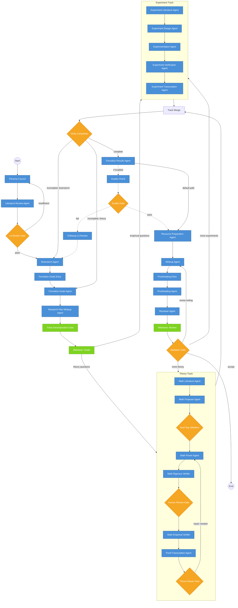

# PoggioAI/MSc

> End-to-end agentic research system -- from question to paper, autonomously.

Built by the [Poggio Lab](https://poggio-lab.mit.edu/) at MIT.


[Website](https://PoggioAI.github.io) | [Discord](https://discord.gg/Pz7spPPY) | [Paper](https://PoggioAI.github.io) | [GitHub](https://github.com/PoggioAI/PoggioAI_MSc)

---

## What is MSc?

**MSc** (Multi-agent Scientific Collaboration) is an open-source research automation system that transforms a research question into a complete, submission-ready manuscript. It orchestrates 22 specialist agent nodes across a structured pipeline covering literature review, theory development, experimental design, synthesis, and writing -- all coordinated through a LangGraph backbone with stage-level validation gates.

The system goes beyond simple prompt chaining. MSc supports multi-model counsel debate (where multiple frontier models argue and converge on key decisions), tree search exploration (inspired by AI Scientist-v2), and campaign orchestration for multi-stage research projects. You provide a research question; MSc delivers a literature-grounded, mathematically rigorous, experimentally supported manuscript draft in markdown or LaTeX. The goal is to reduce the hundreds of steering prompts typically required to produce a research paper down to fewer than ten.

---

## New User Setup Guide

### Prerequisites

- **Python 3.10+** (3.11 recommended)
- **Git**
- **An OpenRouter API key** (https://openrouter.ai) -- all models are accessed through OpenRouter
- (Optional) **LaTeX** for PDF output
- (Optional) **SLURM** for HPC cluster execution

### Step 1: Install

```bash
git clone https://github.com/PoggioAI/PoggioAI_MSc.git
cd PoggioAI_MSc
git checkout MSc_Prod
```

Create a virtual environment with Python 3.10+. Check your version first:

```bash
python3 --version   # Must be 3.10 or higher
```

If your default `python3` is 3.10+:

```bash
python3 -m venv .venv
source .venv/bin/activate
pip install --upgrade pip
pip install -e .
```

If your default Python is older (e.g., 3.9), use one of these alternatives:

```bash
# macOS with Homebrew
brew install python@3.12
python3.12 -m venv .venv
source .venv/bin/activate
pip install --upgrade pip
pip install -e .

# With conda
conda create -n msc python=3.12 -y
conda activate msc
pip install -e .
```

Optional extras for additional capabilities:

```bash
# All optional dependencies
pip install -e ".[all]"

# Web search and retrieval
pip install -e ".[web]"

# Experiment execution support
pip install -e ".[experiment]"

# Documentation tools
pip install -e ".[docs]"
```

### Step 2: Setup Wizard

```bash
msc setup
```

The setup wizard will:

1. **Detect your platform** -- identifies OS, Python version, SLURM availability, and installed tools (LaTeX, etc.).
2. **Configure API keys** -- prompts for your OpenRouter key and optional provider keys, stores them securely in `~/.msc/.env`.
3. **Select price tier** -- choose a tier (budget/light/medium/pro/max) which sets your default model, budget cap, and counsel configuration.
4. **Configure notifications** (optional) -- set up Telegram or Slack alerts for run completion.

### Step 3: Verify Installation

```bash
msc doctor
```

This runs a comprehensive environment check: Python version, installed packages, API key validity, model connectivity, disk space, and optional tool availability. Fix any reported issues before proceeding.

### Step 4: Run Your First Research

```bash
# Quick test (budget tier, up to $35, ~30 min)
msc run --tier budget "What are the key differences between transformer and state-space models?"

# Validate setup without spending anything
msc run --tier budget --dry-run "Test task"

# Standard (up to $200, ~6 hrs, default tier)
msc run "Survey the landscape of mechanistic interpretability methods"

# With counsel debate (up to $400, ~12 hrs)
msc run --tier pro "Analyze the theoretical foundations of in-context learning"

# Maximum quality (up to $750, ~24+ hrs)
msc run --tier max "Comprehensive analysis of attention mechanisms"
```

Each run creates a timestamped output directory containing all intermediate artifacts, the final manuscript, and a detailed execution log.

### Step 5: Check Results

```bash
msc status     # View running pipelines
msc logs -f    # Tail live output
msc runs       # List past runs
```

Output manuscripts are saved to the `results/` directory by default.

---

## Tiers

MSc uses a tier system to control cost, quality, and which features are enabled. Select a tier with `--tier` (or `-t`). The default tier is `medium`.

| Tier | Budget Cap | Time | Model | Key Features |
|------|-----------|------|-------|--------------|
| `budget` | $35 | ~30 min | gpt-5-mini | Single model, markdown output |
| `light` | $75 | ~2 hrs | gpt-5-mini | Planning enabled |
| `medium` | $200 | ~6 hrs | claude-sonnet-4-6 | LaTeX output, math agents, per-agent model routing |
| `pro` | $400 | ~12 hrs | claude-opus-4-6 | 2-round counsel debate, adversarial verification |
| `max` | $750 | ~24+ hrs | claude-opus-4-6 | 4-model counsel (3 rounds), tree search, full Opus pipeline |
| `ultra` | $2000 | ~48+ hrs | claude-opus-4-6 | 4-model counsel (5 rounds), deep tree search, 5-reviewer ensemble, all-Opus agents |

Individual features can be toggled independently of the tier:

```bash
# Use budget tier but enable counsel anyway
msc run --tier budget --counsel "My question"

# Use medium tier but disable math agents
msc run --no-math "My question"
```

---

## Configuration

All configuration is stored in `~/.msc/config.yaml`. Common settings:

```bash
msc config get model                      # View current model
msc config set model claude-opus-4-6      # Set primary model
msc config set budget_usd 50              # Set default budget cap
msc config set output_format latex         # latex or markdown
msc config set counsel_enabled true        # Enable multi-model debate
```

You can also edit `~/.msc/config.yaml` directly.

---

## Campaigns (Multi-Stage Research)

Campaigns orchestrate multi-stage research projects where each stage builds on prior results. Use them for projects that span multiple related questions or require iterative deepening.

```bash
# Initialize a campaign from a research directive
msc campaign init --name "my_project" --task "Investigate the role of normalization layers in transformer training dynamics"

# Review and customize the generated campaign spec
# (edit my_project_campaign.yaml as needed)

# Launch the campaign
msc campaign start my_project_campaign.yaml

# Monitor progress
msc campaign status my_project_campaign.yaml

# List all campaigns
msc campaign list
```

Campaigns support automatic archival of completed stages, budget enforcement with threshold alerts, artifact validation gates, and resume-on-failure.

---

## Notifications

Stay informed about long-running pipelines without watching the terminal.

```bash
# Interactive notification setup
msc notify setup

# Test a configured channel
msc notify test --channel telegram

# Supported channels: telegram, slack
```

Notifications fire on run completion, budget threshold warnings, and pipeline errors.

---

## OpenClaw Integration

OpenClaw provides optional autonomous oversight for long-running campaigns. It monitors pipeline health, detects stalls, and can trigger repairs without human intervention.

```bash
# One-time setup
msc openclaw setup

# Start the oversight agent
msc openclaw start

# Check oversight status
msc openclaw status
```

OpenClaw is particularly useful for HPC deployments where runs span multiple SLURM jobs.

---

## Supported Models

| Provider | Models |
|---|---|
| Anthropic | `claude-opus-4-6`, `claude-sonnet-4-6`, `claude-sonnet-4-5` |
| OpenAI | `gpt-5`, `gpt-5-mini`, `gpt-5-nano`, `gpt-5.4`, `gpt-5.4-pro`, `gpt-5.3-codex`, `gpt-5.2` |
| OpenAI (reasoning) | `o3`, `o3-pro`, `o4-mini`, `o3-deep-research`, `o4-mini-deep-research` |
| Google | `gemini-3.1-pro-preview`, `gemini-3-pro-preview`, `gemini-3-flash-preview`, `gemini-2.5-pro`, `gemini-2.5-flash` |
| DeepSeek | `deepseek-chat`, `deepseek-v3.2`, `deepseek-r1` |
| xAI | `grok-4-0709` |

All models are routed through [OpenRouter](https://openrouter.ai). You only need `OPENROUTER_API_KEY` set in your environment (configured during `msc setup`). For counsel mode (multi-model debate), no additional configuration is needed -- OpenRouter provides access to all providers.

---

## Architecture Overview

MSc decomposes a research task into a directed graph of 22+ specialist agent nodes, executed via LangGraph. The pipeline has four phases: discovery, parallel track execution (theory + experiments), synthesis, and paper production, with validation gates and feedback loops throughout.



### Agent Roles

- **Literature agents** -- search, retrieve, and synthesize relevant prior work.
- **Theory agents** -- develop formal claims, theorems, and proofs grounded in the literature.
- **Experiment agents** -- design and execute computational experiments to validate theoretical claims.
- **Synthesis agents** -- reconcile theory and experimental results, identify gaps, trigger follow-up loops.
- **Writing agents** -- produce structured manuscript sections with proper citations and mathematical typesetting.
- **Validation gates** -- enforce an artifact contract at each stage, ensuring outputs meet quality thresholds before downstream consumption.

### Counsel Mode

At critical decision points, counsel mode convenes a panel of frontier models (e.g., Claude, GPT, Gemini) to debate and converge. Each model independently evaluates the current state, then a structured aggregation protocol synthesizes their judgments. This reduces single-model blind spots and improves robustness.

### Tree Search

Inspired by the AI Scientist-v2 paper, MSc implements DAG-layered best-first search over the research claim graph. When the pipeline encounters branching theoretical directions or experimental choices, tree search systematically explores alternatives, prunes unpromising paths, and selects the strongest trajectory.

### Campaign System

For projects that span multiple related research questions, the campaign system orchestrates sequential and parallel stages with dependency tracking, budget allocation, artifact handoff between stages, and automatic archival.

---

## Advanced Usage

### Run Options

All `msc run` flags:

| Flag | Short | Description |
|------|-------|-------------|
| `--tier` | `-t` | Price tier: `budget`, `light`, `medium` (default), `pro`, `max` |
| `--model` | `-m` | Override the LLM model (e.g., `claude-opus-4-6`) |
| `--budget` | `-b` | Override budget cap in USD |
| `--counsel` / `--no-counsel` | | Toggle multi-model debate |
| `--math` / `--no-math` | | Toggle math agents |
| `--tree-search` / `--no-tree-search` | | Toggle tree search exploration |
| `--output-format` | `-o` | `markdown` or `latex` |
| `--task-file` | `-f` | Read task from a file instead of the command line |
| `--mode` | | `local`, `tinker`, or `hpc` |
| `--dry-run` | | Validate setup without running (no cost) |
| `--max-run-seconds` | | Hard timeout in seconds |
| `--stream` / `--no-stream` | | Toggle streaming display (default: on) |

### Custom Task Files

For complex research directives that exceed a single command, write a task file:

```bash
msc run --task-file my_task.txt
```

The task file can include structured instructions, scope constraints, specific references to include, and output format preferences.

### Resume Interrupted Runs

If a run is interrupted (network failure, budget pause, system restart), resume from the last checkpoint:

```bash
msc resume                          # Resume most recent interrupted run
msc resume <run_id>                 # Resume a specific run
msc resume --start-from <stage>     # Resume from a specific pipeline stage
```

MSc persists all intermediate artifacts and pipeline state, so resumption avoids re-executing completed stages.

### SLURM / HPC Mode

On HPC clusters with SLURM:

```bash
msc run --mode hpc "Analyze convergence properties of adaptive optimizers"
```

This submits pipeline stages as SLURM jobs with appropriate resource requests, handles job dependencies, and manages cross-node state.

### Budget Management

Track and control spending:

```bash
msc budget                              # View spending summary across all runs
msc budget --results-dir results/myrun  # Spending for a specific run
msc config set budget_usd 50            # Set default cap
```

Budget enforcement is hard-capped: the pipeline halts cleanly when the limit is reached, preserving all artifacts produced so far.

---

## CLI Reference

```
msc setup              First-time configuration wizard
msc run                Start a research pipeline
msc doctor             Environment and dependency check
msc status             Check running pipelines
msc logs               Tail pipeline output
msc runs               List past runs
msc resume             Resume an interrupted run
msc campaign init      Create a new campaign
msc campaign start     Launch a campaign
msc campaign status    Check campaign progress
msc campaign repair    Trigger repair on a failed stage
msc campaign list      List campaign files
msc config get         View a configuration value
msc config set         Set a configuration value
msc config list        Show all configuration values
msc config edit        Open config in editor
msc config path        Show config directory path
msc budget             View spending summary
msc notify setup       Configure notifications
msc notify test        Test a notification channel
msc openclaw setup     One-time OpenClaw setup
msc openclaw start     Start oversight agent
msc openclaw status    Check oversight status
msc openclaw stop      Stop the OpenClaw gateway
msc install <extra>    Install optional extras (web, experiment, docs, all, ...)
msc --help             Show help for any command
msc --version          Show version
```

Use `msc <command> --help` for detailed usage of any subcommand.

---

## Important Remarks

This project was vibecoded in about 3 weeks using Claude Code and Cursor, but encodes years of accumulated intuition about how ML research should be conducted. The specialist agent prompts, validation gates, and pipeline structure reflect deliberate methodological choices.

**Always review MSc outputs carefully.** Run sanity checks on novelty claims, verify mathematical proofs with your reasoning model of choice, and cross-reference the literature review against your own knowledge. MSc is a powerful drafting tool, not a substitute for scientific judgment.

We were inspired by [freephdlabor](https://github.com/ltjed/freephdlabor) and [OpenClaw](https://docs.openclaw.ai/).

---

## License

MIT. See [LICENSE](LICENSE) for details.
