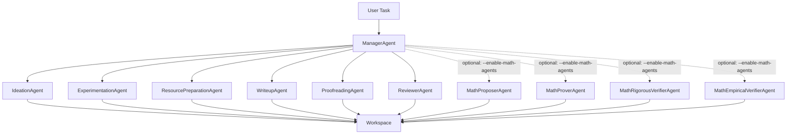
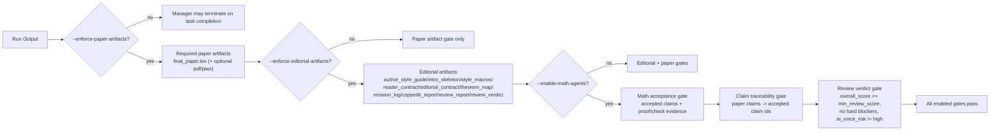

# freephdlabor Runbook

This repository runs a multi-agent research workflow from a local workspace.

Built for a **human-on-the-loop** workflow (not human-in-the-loop), freephdlabor is designed to let researchers steer direction while autonomous, customizable, and promptable agents execute the heavy research work. The goal is simple: keep human intent and scientific taste at the center, while the agent system performs at the best level your guidance can unlock.

## System Map

### Agent Orchestration



### Artifact and Quality Gates



## 1) Prerequisites

- macOS or Linux
- Conda installed
- Python 3.11 (managed by bootstrap script)
- At least one LLM API key

## 2) Install (Recommended)

From repo root:

```bash
./scripts/bootstrap.sh researchlab full
```

Install profiles:

- `minimal`: core runtime only
- `docs`: document/audio parsing extras
- `web`: web crawling extras (includes Playwright Chromium install)
- `experiment`: experiment stack
- `latex`: TeX toolchain (`pdflatex`/`bibtex`) for paper compilation
- `full`: all capabilities

You can combine profiles:

```bash
./scripts/bootstrap.sh researchlab minimal,web
```

Activate the environment before running:

```bash
conda activate researchlab
```

## 3) Configure API Keys

Create `.env` in repo root:

```bash
OPENAI_API_KEY=your_key_here
# Optional providers
ANTHROPIC_API_KEY=...
GOOGLE_API_KEY=...
OPENROUTER_API_KEY=...
DEEPSEEK_API_KEY=...
```

## 4) Preflight Check

```bash
python scripts/preflight_check.py --with-docs --with-web --with-experiment --with-latex
```

If you did not install all capabilities, remove the related flags.

For paper/editorial runs, LaTeX is now fail-fast checked at launcher startup.
If `pdflatex`/`bibtex` are missing, the run exits immediately with fix commands.

Recommended one-time setup (per conda env) on macOS with MacTeX:

```bash
brew install --cask mactex
conda env config vars set -n freephdlabor \
  FREEPHDLABOR_PDFLATEX_PATH=/Library/TeX/texbin/pdflatex \
  FREEPHDLABOR_BIBTEX_PATH=/Library/TeX/texbin/bibtex
conda deactivate && conda activate freephdlabor
python scripts/preflight_check.py --with-latex
```

If you see `I can't find the format file pdflatex.fmt` during runs, repair the
active conda environment with:

```bash
./scripts/fix_pdflatex_conda.sh freephdlabor
```

## 5) Start a New Run

```bash
python launch_multiagent.py \
  --reasoning-effort none \
  --verbosity low \
  --task "Summarize inputs and propose next research steps."
```

By default, stdout/stderr are redirected to:

- `logs/freephdlabor_<timestamp>.out`
- `logs/freephdlabor_<timestamp>.err`

Disable file logging if needed:

```bash
python launch_multiagent.py --no-log-to-files --task "..."
```

## CLI Options Reference

`launch_multiagent.py` supports:

- `--model`: model id from supported model list.
- `--interpreter`: python interpreter path used for experiment execution.
- `--debug`: enable debug logging.
- `--log-to-files`: force stdout/stderr file redirection (default on).
- `--no-log-to-files`: disable stdout/stderr file redirection.
- `--reasoning-effort`: `none|minimal|low|medium|high|xhigh`.
- `--verbosity`: `low|medium|high`.
- `--callback_host`: callback server host for live steering (default `127.0.0.1`).
- `--callback_port`: callback server port for live steering (default `5001`).
- `--enable-planning`: enable periodic plan/replan behavior.
- `--planning-interval`: planning frequency in steps when planning is enabled.
- `--resume`: resume an existing workspace directory.
- `--task`: task text for new or resumed run.
- `--require-pdf`: require `final_paper.pdf` for successful paper termination.
- `--enforce-paper-artifacts`: enforce required paper deliverable artifacts.
- `--manager-max-steps`: override manager max steps.
- `--enable-math-agents`: enable math proposer/prover/verifier agents.
- `--require-experiment-plan`: require `experiments_to_run_later.md` when paper artifact enforcement is active.
- `--enforce-editorial-artifacts`: require editorial workflow artifacts for high-quality writing runs.
- `--min-review-score`: strict reviewer threshold for editorial gate (default `8`).

## 6) Resume an Existing Workspace

```bash
python launch_multiagent.py \
  --resume /absolute/path/to/results/my_project_001 \
  --task "Continue from existing outputs."
```

## 7) Live Steering (Interrupt Without Restart)

The launcher starts a callback socket (default `127.0.0.1:5001`).

From another terminal:

```bash
nc 127.0.0.1 5001
```

Then send:

1. `interrupt` (or `stop` / `pause`)
2. Your instruction text
3. Enter twice (empty line, empty line)
4. `m` for modification or `n` for new task

Behavior:

- This does not restart the process.
- The run pauses at a step boundary, appends your instruction, and resumes.

## 8) Stop a Running Job

Same terminal:

- `Ctrl + C`

From another terminal:

```bash
pkill -f launch_multiagent.py
```

Target PID directly:

```bash
pgrep -f launch_multiagent.py
kill <PID>
```

Last resort:

```bash
kill -9 <PID>
```

## 9) Paper Reliability Gates

Use these when you want strict paper deliverables:

```bash
python launch_multiagent.py \
  --resume /absolute/path/to/results/my_project_001 \
  --task "Write and refine the paper, then produce final_paper.tex and final_paper.pdf." \
  --enforce-paper-artifacts \
  --enforce-editorial-artifacts \
  --min-review-score 8 \
  --require-pdf \
  --require-experiment-plan \
  --manager-max-steps 30
```

What this enforces:

- truthful artifact reporting in final answer
- required files present before successful termination
- if `--enforce-editorial-artifacts` is enabled:
  - `paper_workspace/author_style_guide.md`
  - `paper_workspace/intro_skeleton.tex`
  - `paper_workspace/style_macros.tex`
  - `paper_workspace/reader_contract.json`
  - `paper_workspace/editorial_contract.md`
  - `paper_workspace/theorem_map.json`
  - `paper_workspace/revision_log.md`
  - `paper_workspace/copyedit_report.md`
  - `paper_workspace/review_report.md`
  - `paper_workspace/review_verdict.json`
  - plus `paper_workspace/claim_traceability.json` when `--enable-math-agents` is active
  - reviewer verdict gate: `overall_score >= --min-review-score`, no hard blockers, and `ai_voice_risk != high`

Editorial artifact mode is optional and intended for high-quality, final-form writing runs.

## 10) Math Workflow (Theorem/Proof Pipeline)

Enable math agents:

```bash
python launch_multiagent.py \
  --resume /absolute/path/to/results/my_project_001 \
  --task "Develop and validate theorem claims for this ML theory project." \
  --enable-math-agents
```

Math workspace artifacts:

- `math_workspace/claim_graph.json`
- `math_workspace/proofs/<claim_id>.md`
- `math_workspace/checks/<claim_id>.jsonl`
- `math_workspace/lemma_library.md`

Manager-side acceptance gate (enabled during math runs):

- accepted claims must have proof/check artifacts
- symbolic audit must pass
- numeric evidence must pass or be explicitly waived
- accepted claims can only depend on accepted claims
- all `must_accept` claims must be accepted

If this gate fails, termination is blocked with `TERMINATION_BLOCKED`.

## 11) Lemma Library (Fast Path for Known Lemmas)

If `lemma_library.md` is missing, a starter file is auto-created when the claim graph is initialized.
An incremental index file is also maintained at `math_workspace/lemma_library_index.json` for low-token updates.

Low-token incremental workflow (recommended):

```bash
# list entries
python scripts/lemma_library_cli.py --workspace /absolute/path/to/results/my_project_001/math_workspace list

# fetch one entry only
python scripts/lemma_library_cli.py --workspace /absolute/path/to/results/my_project_001/math_workspace get --lemma-id L_smooth_descent_standard

# add or update one lemma
python scripts/lemma_library_cli.py --workspace /absolute/path/to/results/my_project_001/math_workspace upsert \
  --lemma-id L_matrix_holder \
  --tier tier1 \
  --statement "<A,B> <= ||A||_2 ||B||_* for compatible matrices." \
  --conditions "Finite-dimensional real matrices with compatible shapes." \
  --source "Matrix analysis reference" \
  --usage-notes "Use for operator-vs-nuclear norm bounds." \
  --tags-json '["area:matrix","origin:library"]'

# mark usage (helps keep active lemmas prioritized)
python scripts/lemma_library_cli.py --workspace /absolute/path/to/results/my_project_001/math_workspace touch --lemma-id L_matrix_holder
```

Create/update manually:

```bash
mkdir -p /absolute/path/to/results/my_project_001/math_workspace
```

Suggested format:

```markdown
# Standard Lemma Library (Math Fast Path)

## L_smooth_descent
- tier: 1
- area: optimization
- statement: If f is L-smooth, then f(y) <= f(x) + <grad f(x), y-x> + (L/2)||y-x||^2.
- assumptions:
  - f is differentiable
  - grad f is L-Lipschitz
- source: Nesterov, Introductory Lectures on Convex Optimization
- usage_notes: use for descent-step bounds

## L_operator_nuclear_duality
- tier: 1
- area: matrix
- statement: <A,B> <= ||A||_2 ||B||_*
- assumptions:
  - A,B are real matrices with compatible shape
- source: Matrix Analysis texts
- usage_notes: use in operator-vs-nuclear norm arguments
```

Prompt to generate a high-quality library with GPT Pro:

```text
Create a production-ready `lemma_library.md` for an ML-theory project.

Requirements:
1. Output only markdown content for the file.
2. Include 30-80 lemmas max, prioritized by practical reuse for optimization/matrix/scaling-law proofs.
3. For each lemma, use this schema exactly:
   - id (heading, e.g., ## L_smooth_descent)
   - tier (0 primitive, 1 standard ML-theory, 2 specialized known, 3 novel)
   - area
   - statement (precise and checkable)
   - assumptions (explicit list)
   - source (book/paper/internal note)
   - usage_notes (1 line)
4. Do not include uncheckable vague statements.
5. Keep notation consistent and define conventions if needed.
6. Prefer lemmas that reduce proof-token cost (common inequalities, smoothness/convexity tools, matrix norm identities, concentration basics).
7. Add a short "Policy" section at top explaining when to use library-backed lemmas vs proving from scratch.

Project context:
- Focus: ML-theory papers with matrix calculus and optimization.
- Goal: avoid wasting reasoning budget on known/easy lemmas.
```

## 12) Context File Ingestion (PDF/TXT/MD)

Place files:

```bash
mkdir -p /absolute/path/to/results/my_project_001/inputs
```

Run:

```bash
python launch_multiagent.py \
  --resume /absolute/path/to/results/my_project_001 \
  --reasoning-effort none \
  --verbosity low \
  --task "Read inputs/*.pdf and inputs/*.md and inputs/*.txt. Create context_summary.md. Do NOT run experiments."
```

## 13) Common Issues

### `ModuleNotFoundError: yaml` / `smolagents` / `litellm`

Environment is incomplete. Re-run bootstrap:

```bash
./scripts/bootstrap.sh researchlab minimal
conda activate researchlab
python scripts/preflight_check.py
```

### Missing optional dependency (example: `crawl4ai`)

```bash
./scripts/bootstrap.sh researchlab web
```

### Playwright Chromium missing

```bash
python -m playwright install chromium
```

### Audio warning about ffmpeg

```bash
brew install ffmpeg
```

### No API key detected

Check `.env` and shell environment variables.

### Reduce citation retries / token burn

```bash
export FREEPHDLABOR_SS_MAX_RETRIES=2
export FREEPHDLABOR_SS_BASE_DELAY_SEC=2
export FREEPHDLABOR_SS_COOLDOWN_SEC=60
```

### Limit very large tool output in context

```bash
export FREEPHDLABOR_SEE_FILE_MAX_CHARS=12000
export FREEPHDLABOR_SEARCH_MAX_CHARS=12000
export FREEPHDLABOR_SEARCH_MAX_MATCHES=200
```

## 14) Git Hygiene Before Push

Before pushing:

```bash
git status -sb
```

Sanity notes:

- `.env`, `logs/`, `results/`, and `*.log` are ignored by default.
- Confirm no secrets are tracked.
- Confirm only intended code/docs changes are staged.
