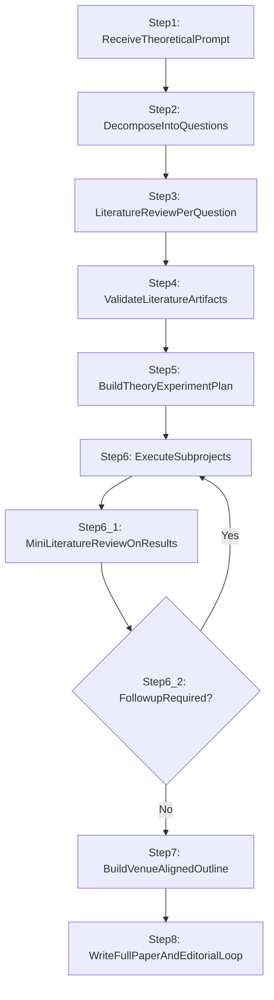
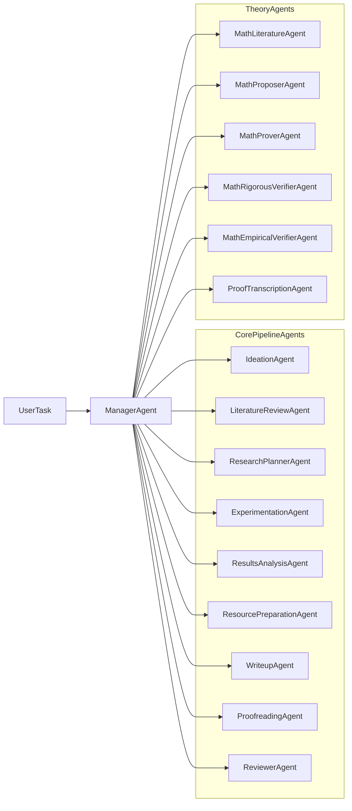
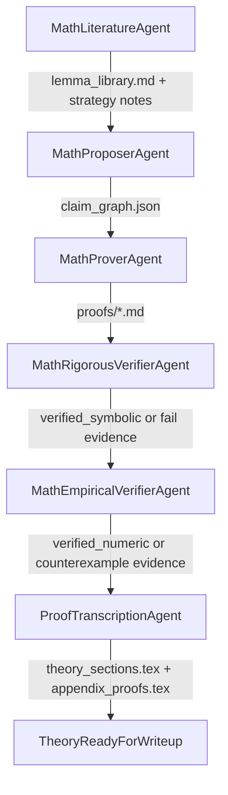

# freephdlabor: Full-Research Multi-Agent Pipeline

`freephdlabor` is a local multi-agent research system for generating literature-grounded, theory-aware, experiment-backed papers.

The repository now supports a full iterative research pipeline (`--pipeline-mode full_research`) in addition to legacy/default and fast/quick modes.

## Pipeline Overview

### Full-Research 8-Step Flow



### Agent Orchestration Map



### Theory Sub-Pipeline



## Pipeline Modes

- `default`
  - Legacy adaptive workflow with strong reviewer and artifact gating.
  - Recommended sequence: Ideation -> Experimentation -> ResourcePreparation -> Writeup -> Proofreading -> Reviewer.
- `full_research`
  - Mandatory 8-step pipeline with literature review, planning, iterative follow-up loop, outline, and full writeup.
  - Enables strict intermediate artifact contracts.
- `quick`
  - Reduced-depth loops for faster iteration while still enforcing truthfulness and core quality gates.

## Code Architecture

| Module | Purpose |
|---|---|
| `launch_multiagent.py` | Thin entry point — imports and calls `freephdlabor/runner.py` |
| `freephdlabor/runner.py` | All run logic: workspace setup, model config, artifact gating, agent execution |
| `freephdlabor/prereqs.py` | LaTeX binary detection (`pdflatex`, `bibtex`) and fix instructions |
| `freephdlabor/args.py` | CLI argument definitions |
| `freephdlabor/config.py` | LLM parameter normalisation across providers |
| `freephdlabor/supervision/` | All quality-gate validation: result, review verdict, paper quality, math acceptance, claim traceability |
| `freephdlabor/agents/` | All agent classes (Manager, Ideation, Writeup, Math pipeline, etc.) |
| `freephdlabor/toolkits/` | Tool implementations (see Toolkit Groups below) |
| `freephdlabor/prompts/` | System prompt templates for each agent |

### Toolkit Groups

| Directory | Contains |
|---|---|
| `toolkits/search/` | arXiv, OpenDeepSearch, web browser, text inspector, visual QA |
| `toolkits/filesystem/` | File editing tools, knowledge-base / repo management |
| `toolkits/ideation/` | Idea generation, refinement, novelty checking, paper search |
| `toolkits/experimentation/` | Experiment runner, idea standardisation |
| `toolkits/communication/` | `talk_to_user` tool |
| `toolkits/writeup/` | LaTeX generation, compiler, citation search, plotting |
| `toolkits/math/` | Claim graph, proof workspace, numerical verifier |

## Artifact Contracts

### Full-Research Step Contracts

- Step 3 (`LiteratureReviewAgent`)
  - `paper_workspace/literature_review.tex`
  - `paper_workspace/literature_review.pdf`
  - `paper_workspace/literature_review_sources.json`
  - `paper_workspace/literature_review_matrix.md`
  - `paper_workspace/references.bib`
- Step 5 (`ResearchPlannerAgent`)
  - `paper_workspace/research_plan.tex`
  - `paper_workspace/research_plan.pdf`
  - `paper_workspace/research_plan_tasks.json`
  - `paper_workspace/research_plan_risk_register.md`
- Step 6.1 (`ResultsAnalysisAgent`)
  - `paper_workspace/results_assessment.tex`
  - `paper_workspace/results_assessment.pdf`
  - `paper_workspace/followup_decision.json`
  - `paper_workspace/followup_literature_notes.md`
- Step 7 (`WriteupAgent` outline mode)
  - `paper_workspace/paper_outline.md`
- Step 8 (final writeup)
  - `final_paper.tex`
  - `final_paper.pdf` (if `--require-pdf` or task requires it)

### Theory Artifact Contracts

- `math_workspace/claim_graph.json`
- `math_workspace/proofs/<claim_id>.md`
- `math_workspace/checks/<claim_id>.jsonl`
- `paper_workspace/theory_sections.tex`
- `paper_workspace/appendix_proofs.tex`

## Quality Gates

When enabled, the manager enforces:

- Paper artifact gate (`--enforce-paper-artifacts`)
  - minimum: `final_paper.tex`
  - optional strict additions: `final_paper.pdf`, `experiments_to_run_later.md`
- Editorial artifact gate (`--enforce-editorial-artifacts`)
  - style/structure/review outputs in `paper_workspace/`
- Review verdict gate
  - `overall_score >= --min-review-score` (default `8`)
  - no hard blockers
  - AI voice risk not high
- Math acceptance gate (`--enable-math-agents`)
  - accepted claims need proof/check evidence and valid dependency status
- Full-research intermediate gate (`--pipeline-mode full_research`)
  - manager validates intermediate PDFs/decision artifacts before successful termination

## Installation

### Prerequisites

- macOS or Linux
- Conda
- Python 3.11 (managed by bootstrap)
- At least one LLM API key

### Recommended Setup

From repo root:

```bash
./scripts/bootstrap.sh researchlab full
conda activate researchlab
```

Install profiles:

- `minimal`: core runtime
- `docs`: document/audio parsing extras
- `web`: web crawling extras (includes Playwright Chromium install)
- `experiment`: experiment stack
- `latex`: TeX toolchain (`pdflatex`/`bibtex`)
- `full`: all capabilities

Combine profiles if needed:

```bash
./scripts/bootstrap.sh researchlab minimal,web
```

## Configuration

Create `.env` at repo root:

```bash
OPENAI_API_KEY=your_key_here
# Optional providers
ANTHROPIC_API_KEY=...
GOOGLE_API_KEY=...
OPENROUTER_API_KEY=...
DEEPSEEK_API_KEY=...
```

Optional model/toolchain config:

- `.llm_config.yaml` for model-level settings
- `FREEPHDLABOR_PDFLATEX_PATH` / `FREEPHDLABOR_BIBTEX_PATH` env vars for explicit LaTeX binaries

## Preflight Check

```bash
python scripts/preflight_check.py --with-docs --with-web --with-experiment --with-latex
```

Remove flags if you did not install all capability profiles.

For paper/editorial runs, launcher startup fail-fast checks LaTeX prerequisites.

## Quick Start

### Default Mode

```bash
python launch_multiagent.py \
  --task "Investigate this research direction and produce a paper draft." \
  --pipeline-mode default
```

### Full-Research Mode (Recommended for your new pipeline)

```bash
python launch_multiagent.py \
  --task "Given this theoretical prompt, run the complete literature-plan-execution-writeup loop." \
  --pipeline-mode full_research \
  --followup-max-iterations 3 \
  --enable-math-agents \
  --enforce-paper-artifacts \
  --enforce-editorial-artifacts \
  --min-review-score 8 \
  --require-pdf
```

### Quick Mode

```bash
python launch_multiagent.py \
  --task "Produce a fast exploratory pass of this topic." \
  --pipeline-mode quick
```

### HPC / SLURM

For cluster submission use the SLURM launcher at `scripts/launch_multiagent_slurm.sh`.

```bash
./scripts/launch_multiagent_slurm.sh
```

## CLI Reference

`launch_multiagent.py` arguments:

- `--model`
- `--interpreter`
- `--debug`
- `--log-to-files` / `--no-log-to-files`
- `--reasoning-effort` (`none|minimal|low|medium|high|xhigh`)
- `--verbosity` (`low|medium|high`)
- `--callback_host`
- `--callback_port`
- `--enable-planning`
- `--planning-interval`
- `--resume`
- `--task`
- `--manager-max-steps`
- `--pipeline-mode` (`default|full_research|quick`)
- `--followup-max-iterations`
- `--enable-math-agents`
- `--enforce-paper-artifacts`
- `--require-pdf`
- `--require-experiment-plan`
- `--enforce-editorial-artifacts`
- `--min-review-score`

See implementation in `freephdlabor/args.py`.

## Workspace Structure

A typical run workspace (inside `results/freephdlabor_<timestamp>/`) contains:

```text
results/freephdlabor_<timestamp>/
  final_paper.tex
  final_paper.pdf
  paper_workspace/
    literature_review.pdf
    research_plan.pdf
    results_assessment.pdf
    followup_decision.json
    paper_outline.md
  math_workspace/
    claim_graph.json
    proofs/
    checks/
    lemma_library.md
  experiment_results/
  inter_agent_messages/
  <agent_name>/
```

## Resume Existing Workspace

```bash
python launch_multiagent.py \
  --resume /absolute/path/to/results/freephdlabor_<timestamp> \
  --task "Continue from the current state and improve the final deliverable."
```

## Live Steering (Interrupt Without Restart)

The launcher opens an interruption socket (default `127.0.0.1:5001`).

From another terminal:

```bash
nc 127.0.0.1 5001
```

Then send:

1. `interrupt` (or `stop` / `pause`)
2. Your instruction
3. Empty line, empty line
4. `m` for modification or `n` for new task

## Stop a Running Job

Same terminal:

```bash
Ctrl + C
```

Another terminal:

```bash
pkill -f launch_multiagent.py
```

Or target PID:

```bash
pgrep -f launch_multiagent.py
kill <PID>
```

Last resort:

```bash
kill -9 <PID>
```

## Math Workflow and Lemma Library

Enable theory workflow:

```bash
python launch_multiagent.py \
  --resume /absolute/path/to/results/freephdlabor_<timestamp> \
  --task "Develop and validate theorem claims for this project." \
  --enable-math-agents \
  --pipeline-mode full_research
```

Math artifacts:

- `math_workspace/claim_graph.json`
- `math_workspace/proofs/<claim_id>.md`
- `math_workspace/checks/<claim_id>.jsonl`
- `math_workspace/lemma_library.md`

Incremental lemma CLI examples:

```bash
python scripts/lemma_library_cli.py --workspace /absolute/path/to/results/freephdlabor_<timestamp>/math_workspace list
python scripts/lemma_library_cli.py --workspace /absolute/path/to/results/freephdlabor_<timestamp>/math_workspace get --lemma-id L_smooth_descent_standard
python scripts/lemma_library_cli.py --workspace /absolute/path/to/results/freephdlabor_<timestamp>/math_workspace touch --lemma-id L_smooth_descent_standard
```

## Context File Ingestion (PDF/TXT/MD)

Place files:

```bash
mkdir -p /absolute/path/to/results/freephdlabor_<timestamp>/inputs
```

Run:

```bash
python launch_multiagent.py \
  --resume /absolute/path/to/results/freephdlabor_<timestamp> \
  --task "Read inputs/*.pdf, inputs/*.md, and inputs/*.txt, then produce context_summary.md. Do not run experiments."
```

## Running Tests

A test suite covering deterministic components lives in `tests/`:

```bash
pytest tests/
```

Test modules:
- `tests/test_validation.py` — result validation, review verdict, paper quality, math acceptance
- `tests/test_config.py` — LLM config loading, provider-specific parameter filtering
- `tests/test_prereqs.py` — LaTeX binary resolution

## Troubleshooting

### `ModuleNotFoundError` (for example `yaml`, `smolagents`, `litellm`)

```bash
./scripts/bootstrap.sh researchlab minimal
conda activate researchlab
python scripts/preflight_check.py
```

### Missing optional web dependency (for example `crawl4ai`)

```bash
./scripts/bootstrap.sh researchlab web
```

### Playwright Chromium missing

```bash
python -m playwright install chromium
```

### ffmpeg warning

```bash
brew install ffmpeg
```

### No API key detected

Check `.env` and exported shell environment variables.

### Reduce citation retries / token burn

```bash
export FREEPHDLABOR_SS_MAX_RETRIES=2
export FREEPHDLABOR_SS_BASE_DELAY_SEC=2
export FREEPHDLABOR_SS_COOLDOWN_SEC=60
```

### Limit very large tool outputs

```bash
export FREEPHDLABOR_SEE_FILE_MAX_CHARS=12000
export FREEPHDLABOR_SEARCH_MAX_CHARS=12000
export FREEPHDLABOR_SEARCH_MAX_MATCHES=200
```

## Repository Hygiene

- Past failed runs were cleaned from local `results/`.
- Keep local artifacts out of version control (`results/`, `logs/`, `.env`, caches are already ignored).

Before pushing:

```bash
git status -sb
```

Sanity checks:

- no secrets tracked
- only intended code/docs changes staged
- no accidental binary or local runtime artifacts included
