# Architecture Overview

This document describes the system architecture of consortium.

---

## High-Level Architecture

```
┌─────────────────────────────────────────────────────────────┐
│                        ENTRY POINT                          │
│              python launch_multiagent.py --task "..."       │
└───────────────────────┬─────────────────────────────────────┘
                        │
                        ▼
┌─────────────────────────────────────────────────────────────┐
│                      RUNNER (runner.py)                     │
│  • Parses CLI args (args.py)                                │
│  • Loads config (.llm_config.yaml via config.py)            │
│  • Validates API keys, LaTeX prereqs                        │
│  • Creates workspace directory                              │
│  • Writes experiment_metadata.json                          │
│  • Initializes BudgetManager, TokenTracker                  │
│  • Builds LangGraph (build_research_graph_v2 in graph.py)   │
│  • Invokes graph, writes run_summary.json on completion     │
└───────────────────────┬─────────────────────────────────────┘
                        │
                        ▼
┌─────────────────────────────────────────────────────────────┐
│                   LANGGRAPH PIPELINE (graph.py)             │
│                                                             │
│  ResearchState (TypedDict, state.py)                        │
│  ┌────────────────────────────────────────────────────┐     │
│  │  messages (add_messages) │ task │ workspace_dir    │     │
│  │  pipeline_stage_index    │ artifacts │ agent_outputs│     │
│  │  validation_results      │ finished │ ...          │     │
│  └────────────────────────────────────────────────────┘     │
│                                                             │
│  Nodes (each node = one specialist agent invocation):       │
│  Direct-wired linear pipeline: Discovery → Experiment →     │
│  Post-Track (no manager hub — stages are wired directly)    │
│                                                             │
│  Checkpointing: SQLite (checkpoints.db) via LangGraph       │
└───────────────────────┬─────────────────────────────────────┘
                        │
                        ▼
```

---

## Base Pipeline

The pipeline is a direct-wired linear graph organized into three stage groups.
No manager hub — each stage feeds directly into the next.
The diagram below shows the 14 core agent stages; the full V2 graph (`build_research_graph_v2` in `graph.py`) includes additional validation gates, milestones, and feedback loops (~24 total nodes).

```mermaid
flowchart LR
    subgraph Discovery
        A[ideation_agent] --> B[literature_review_agent]
        B --> C[research_planner_agent]
    end
    subgraph Experiment Track
        D[experiment_literature_agent] --> E[experiment_design_agent]
        E --> F[experimentation_agent]
        F --> G[experiment_verification_agent]
        G --> H[experiment_transcription_agent]
    end
    subgraph Post-Track
        I[synthesis_literature_review_agent] --> J[results_analysis_agent]
        J --> K[resource_preparation_agent]
        K --> L[writeup_agent]
        L --> M[proofreading_agent]
        M --> N[reviewer_agent]
    end
    C --> D
    H --> I
    N --> O((FINISH))
```



Validation gates run after the reviewer stage via `supervision/` (artifact checks, review score, paper quality).
A followup loop can send the pipeline back to replanning if the review score is below the threshold.

---

## Math Pipeline Extension (--enable-math-agents)

Math stages are inserted after discovery (research_planner_agent) and before the experiment track:

```
research_planner_agent
    → math_literature_agent     (searches math literature)
    → math_proposer_agent       (builds claim graph)
    → math_prover_agent         (writes proof drafts)
    → math_rigorous_verifier_agent  (symbolic verification)
    → math_empirical_verifier_agent (numerical counterexample search)
    → proof_transcription_agent (formats proofs for paper)
    → experiment_literature_agent
    → ...
```

This extends the pipeline from 14 to 20 stages.

Math artifacts live in `math_workspace/`:
- `claim_graph.json` — DAG of theorems, lemmas, definitions
- `proofs/<id>.md` — proof drafts per claim
- `checks/<id>.jsonl` — symbolic/numerical verification logs
- `lemma_library.md` — reusable standard results

---

## Counsel Mode (--enable-counsel)

When counsel is enabled, each specialist stage runs as a parallel debate:

```
                    ┌── model_0 (claude-opus-4-6) ──┐
                    ├── model_1 (claude-sonnet-4-6) ─┤
task ──→ stage  ──→│── model_2 (gpt-5.4)           ─├──→ synthesis ──→ workspace merge
                    └── model_3 (gemini-3.0-pro)    ─┘
                           ↑ ThreadPoolExecutor ↑
                         (parallel execution)
```

- Each model runs in an isolated sandbox copy of the workspace
- After all models complete, a debate round synthesizes the best output
- The synthesized artifacts are merged back to the main workspace
- Implemented in `counsel.py` via `ThreadPoolExecutor`

---

## Campaign Orchestration (OpenClaw / cron)

For multi-stage autonomous research:

```
campaign.yaml ──→ campaign_heartbeat.py ──→ launch_multiagent.py (subprocess)
     │                    │
     │            checks campaign_status.json (file-locked)
     │            advances stages when artifacts complete
     │
     └──→ stage 1 (theory) ──→ stage 2 (experiments) ──→ stage 3 (paper)
                   ↑ artifacts passed forward via memory distillation ↑
```

See `OpenClaw_Use_Guide.md` for full configuration.

---

## Layer Map

```
consortium/
├── runner.py           Entry point logic, workspace setup, CLI wiring
├── args.py             CLI argument definitions (30+ flags)
├── config.py           YAML config loading, model parameter filtering
├── graph.py            LangGraph StateGraph construction and stage order
├── state.py            ResearchState TypedDict schema
├── utils.py            Model factory, graph builder, helpers
├── budget.py           USD budget tracking and enforcement
├── counsel.py          Multi-model debate and synthesis
├── llm.py              LLM client wrapper (ChatLiteLLM)
├── context_compaction.py  Memory distillation between stages
├── prereqs.py          LaTeX/system prereq validation
│
├── agents/             22 specialist agent implementations
│   ├── base_agent.py   create_specialist_agent() factory
│   └── *_agent.py      Specialist agents (ideation, experiment, math, writeup, ...)
│
├── prompts/            29 system prompt instruction files
│
├── toolkits/           Tool implementations grouped by domain
│   ├── search/         ArXiv, web search, text inspector
│   ├── ideation/       Idea generation, novelty check
│   ├── experimentation/  RunExperimentTool, standardization
│   ├── math/           ClaimGraph, ProofWorkspace, rigor/numerical checkers
│   ├── writeup/        LaTeX generator/compiler, citations, figures
│   └── filesystem/     File I/O, KB indexing
│
├── supervision/        Validation gates
│   ├── supervision_manager.py  Orchestrates validators
│   ├── result_validation.py    Artifact existence checks
│   ├── math_acceptance_validation.py  Math claim acceptance
│   ├── paper_quality_validation.py    Paper content checks
│   ├── paper_traceability_validation.py  Claim-to-source linking
│   └── review_verdict_validation.py   Reviewer score gates
│
├── campaign/           Multi-stage campaign engine
│   ├── spec.py         campaign.yaml schema and loader
│   ├── status.py       campaign_status.json R/W with file locking
│   ├── runner.py       Stage subprocess launcher
│   ├── memory.py       Cross-stage memory distillation
│   └── notify.py       Slack/Telegram notifications
│
├── interaction/        Live steering APIs
│   ├── callback_tools.py  TCP socket interrupt listener
│   └── http_steering.py   HTTP interrupt API (port+1)
│
└── logging/            Structured logging
```

---

## Key Invariants

1. **State is append-only**: `messages` uses `add_messages` reducer — agents append, never overwrite
2. **Pipeline order is deterministic**: `pipeline_stages` list is fixed at run start; graph edges are wired directly
3. **Workspace is isolated**: Each run gets its own `results/consortium_<timestamp>/` directory
4. **Budget is hard-enforced**: `BudgetExceededError` stops the pipeline when `usd_limit` is reached
5. **Checkpointing is automatic**: LangGraph writes SQLite checkpoints after every node — resumable from any stage
