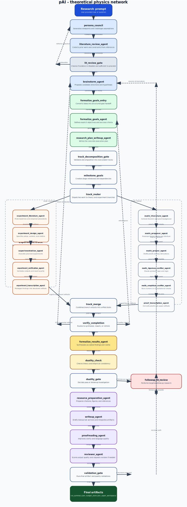

# LangGraph Network Overview

This page summarizes the current v2 LangGraph workflow used by MSc and gives a concise description of what each agent does.

It is intended to be the current, implementation-aligned companion to the older [pipeline flowchart](pipeline_flowchart.png), which reflects an earlier naming scheme.

## Network Diagram



Regenerate this figure with:

```bash
python scripts/render_langgraph_network.py
```

## Agent Summary

### Pre-track stages

- `persona_council`: frames the problem from multiple perspectives, surfaces disagreements, and pressure-tests the initial approach.
- `literature_review_agent`: gathers relevant papers, prior art, and background constraints before committing to a plan.
- `brainstorm_agent`: generates candidate directions, hypotheses, and possible execution paths.
- `formalize_goals_entry`: converts brainstorming output into the structured handoff used by the goals stage.
- `formalize_goals_agent`: turns the research problem into explicit goals, constraints, and success criteria.
- `research_plan_writeup_agent`: writes the actionable plan that downstream theory and experiment tracks will execute.

### Theory track

- `math_literature_agent`: finds theorem-level background, lemmas, and prior formal machinery relevant to the claim.
- `math_proposer_agent`: proposes the formal claim structure and claim graph.
- `math_prover_agent`: drafts proofs or proof sketches for the proposed claims.
- `math_rigorous_verifier_agent`: checks the symbolic rigor of the proof attempt and looks for logical gaps.
- `math_empirical_verifier_agent`: stress-tests mathematical claims numerically or with lightweight computational checks.
- `proof_transcription_agent`: converts accepted proof content into paper-ready LaTeX artifacts.

### Experiment track

- `experiment_literature_agent`: finds empirical precedents, baselines, and methodological references for the experiment path.
- `experiment_design_agent`: specifies datasets, methods, controls, ablations, and evaluation criteria.
- `experimentation_agent`: runs or orchestrates experiments and captures the produced outputs.
- `experiment_verification_agent`: checks whether the experimental outputs are valid, complete, and interpretable.
- `experiment_transcription_agent`: packages experiment results into structured artifacts for synthesis and writing.

### Post-track stages

- `formalize_results_agent`: merges track outputs into a coherent set of claims, findings, and takeaways.
- `resource_preparation_agent`: organizes citations, figures, references, and evidence needed for paper assembly.
- `writeup_agent`: writes the main manuscript and assembles paper artifacts.
- `proofreading_agent`: copy-edits and checks the paper for clarity, consistency, and presentation quality.
- `reviewer_agent`: performs the final review pass and decides whether the run should exit or loop for more work.

## Control Nodes And Gates

- `lit_review_gate`: blocks forward motion when the literature pass says the task is infeasible or underspecified.
- `track_decomposition_gate`: checks that the plan decomposes cleanly into the track structure expected by the graph.
- `track_router`: fans execution out into theory and experiment branches.
- `track_merge`: joins the track outputs back into a single state.
- `verify_completion`: decides whether the current evidence is complete enough to synthesize, needs local rework, or needs a larger rethink.
- `duality_check` and `duality_gate`: validate the coherence between theory and empirical outputs before writeup.
- `followup_lit_review`: performs targeted follow-up research when downstream review or validation fails.
- `validation_gate`: final quality gate that either accepts the run or routes it back into revision.

## Outputs

Typical successful runs produce:

- `run_summary.json`
- `experiment_metadata.json`
- `budget_state.json`
- `paper_workspace/` artifacts such as `final_paper.tex`, review outputs, and supporting track artifacts
